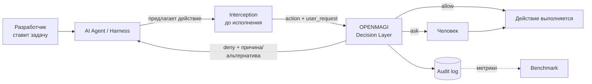

# OPENMAGI — Product Interim

**Status:** Intermediate / Work in Progress
**Stage:** Hackathon intermediate checkpoint
**Дата:** 2026-09-04, ветка `main`

OPENMAGI — внешний слой принятия решений для кодинг-агентов: перед исполнением каждого действия агент спрашивает отдельный сервис и получает `allow | deny | ask`. Сегодня работает ядро (сервис решений), готов инструмент измерения (бенчмарк на 75 кейсов) и отсутствует установленная интеграция с реальным харнессом.

Команда проверяет не «ловим ли мы атаки», а более узкое и более рискованное утверждение: **можно ли снизить количество решений, требующих человека, не увеличив долю пропущенных атак** — и останется ли при этом продукт тем, что пользователь не выключит.

> **Статус утверждений:** **[Ф]** факт — подтверждён кодом, прогоном или внешним источником · **[Р]** решение команды · **[Г]** гипотеза — проверяемая, ещё не проверена · **[П]** предположение — способ проверки не определён · **[?]** утверждение, которое сегодня сделать нельзя.
>
> **Статус функциональности:** *Implemented* — код в основном потоке · *Tested* — покрыт собственными тестами · *Validated* — подтверждён измерением на живой системе · *Hypothesis* — заявлено, но не построено. **Ни один элемент продукта сегодня не имеет статуса Validated.**
>
> **Три оговорки, важные для чтения всего документа.** Пользовательских исследований команда **не проводила**. Бенчмарк **ни разу не запускался против живого сервиса** — поэтому ни одной цифры ASR / Utility / FP / Friction / Latency здесь нет. Целевая архитектура **не равна** текущей реализации; расхождения названы явно.

---

## 1. Target User & Problem

**[Р] Primary user — разработчик, который уже работает с кодинг-агентом в CLI или IDE и уже столкнулся с выбором между подтверждением каждого шага и полным отключением проверок.** Первичный сегмент сужен до **пользователя открытого харнесса** (Kilo Code, OpenCode, Cline/Roo, OpenHands) — один или в небольшой команде. **[Ф]** Основание для сужения: у закрытых вендоров auto mode уже есть (Claude Code, Codex, Cursor), в открытых харнессах сопоставимого движка нет — там выбор пользователя до сих пор бинарный.

**[Г] Secondary:** команда на нескольких харнессах (политика расползается по разным форматам настроек и теряется при смене агента) и организация с требованиями к периметру данных (провайдер LLM-ступени задаётся конфигурацией, вплоть до локальной модели). Оба сегмента — гипотезы, не проверенные ни на одном пользователе.

### Проблема

**Разработчик не может одновременно получить производительность автономного агента и уверенность, что агент не сделает необратимого действия, — потому что единственный доступный ему регулятор (подтверждать / не подтверждать) регулирует не риск, а объём его собственной работы.**

Проблема — не «AI-агенты небезопасны». Проблема в форме конфликта: три величины связаны так, что улучшение одной ухудшает другую.

1. **Автономность даёт продуктивность.** Ради неё пользователь и включает bypass.
2. **Человеческое подтверждение — плохой детектор.** **[Ф]** Слепое исследование Anthropic (n = 1 053): люди одобряют 93 % промптов, явно опасную подменённую команду блокируют в 13,6 % случаев, catch rate падает с ~17 % в начале сессии до ~5 % после 50 промптов. Friction, которую платит пользователь, покупает ему не безопасность, а ощущение контроля.
3. **Цена ошибки необратима** — удалённая production-база, вредоносный пакет, утёкшие секреты.

Отсюда двусторонний тупик: больше подтверждений → выше friction → выше вероятность, что защиту отключат целиком, и тогда она равна нулю; меньше подтверждений → выше вероятность пропуска.

**[Ф]** Кейс добавляет к этой же проблеме два требования, которые команда считает её частью, а не отдельными фичами: после блокировки агент должен **безопасно продолжить работу** (блокировка, после которой агент встал, — тот же простой, только без выбора), и хотя бы один контроль должен быть **архитектурно неуязвим к prompt injection**.

---

## 2. Product Insight & Hypothesis

**[Р]** Ключевой insight команды:

> **Максимальное блокирование и максимальное количество подтверждений — это одно решение, а не два разных: оба перекладывают риск на человека, который заведомо плохо его оценивает, и оба оплачиваются его временем. Продуктовая задача — сократить множество решений, которые вообще требуют человека, не сделав при этом пропуск дешевле.**

Отсюда следует, что **безопасность продукта нельзя оценивать одним числом заблокированных атак.** Слой, который порождает лишние подтверждения и блокировки безопасных действий, снижает автономность агента — то есть ровно ту ценность, ради которой пользователь его поставил. **[Р]** Два следствия: **гейт конкурирует не с сэндбоксом, а с трением ручного подтверждения** (сэндбокс требуется рядом, а не заменяется), и **гарантию можно давать только на ту часть решений, которая принимается детерминированно и без чтения текста** — всё остальное вероятностно и должно так и называться.

### Основная гипотеза

> **[Г] Если** решение о каждом действии агента выносить **вне харнесса**, в отдельном сервисе, где действие сначала приводится к структурному представлению и проходит детерминированную ступень без обращения к LLM, а до модели доходит только нерешённый остаток, **то** доля действий, требующих человека, окажется достаточно низкой, чтобы разработчик не отключил защиту, при доле пропущенных атак не выше, чем в режиме ручного подтверждения, **потому что** большая часть реального трафика агента — рутинные и read-only действия, решаемые правилами за миллисекунды и бесплатно, а человек как детектор работает хуже автоматической проверки.

**Подчинённые гипотезы:**

- **[Г] H2 — гарантия.** Правила, работающие по структуре действия, а не по его тексту, не обходятся инструкцией, попавшей в контекст агента (README, SKILL.md, вывод инструмента). Подтверждено конструкцией и тестами на обфускацию; **[?]** адаптивная атака не пробовалась.
- **[Г] H3 — продолжение работы.** Отказ с причиной и безопасной альтернативой позволяет агенту продолжить задачу другим путём. **[Ф]** Поля ответа и шаблон сообщения есть; **[?]** ни один код их не подставляет.
- **[Г] H4 — переносимость.** Политика, живущая в сервисе, применима к нескольким харнессам. **[Ф]** Контракт единый и распознаёт формы хука двух харнессов; **[?]** ни одного установленного адаптера нет.

**[Р]** Гипотеза сознательно **не** формулируется как «мы безопаснее» или «у нас ниже FPR, чем у конкурентов»: сравнивать эти величины можно только на одном датасете, а публичные вендорские цифры получены на разных наборах.

---

## 3. Value Proposition

**OPENMAGI даёт кодинг-агенту режим, в котором рутина выполняется без подтверждений, опасное останавливается с объяснением и безопасной альтернативой, а человека спрашивают только там, где автоматика не смогла решить, — и каждое такое решение записано и измеримо.**

**User value.** **[Г]** Меньше подтверждений при сопоставимом риске — то, ради чего пользователь сегодня включает bypass; величина эффекта **[?]** не измерена. **[Ф]** Работа не останавливается на отказе: ответ несёт причину и безопасную альтернативу, и формат отказа — часть контракта, а не текст в UI. **[Ф]** Политика — один файл в git, с историей, вместо отдельного формата настроек на каждый агент.

**Interaction model.** Меняется с «подтверди каждое действие» на **риск-зависимое вмешательство**: `allow` по умолчанию для рутины, `deny` с альтернативой вместо остановки, `ask` — дорогой ресурс, расходуемый только там, где автоматика не справилась. **[Р]** `ask` на легитимной работе считается провалом продукта, а не его успехом; это зафиксировано в правилах оценки бенчмарка.

**Technical enabler.** **[Ф]** Каскад «структурная нормализация действия → детерминированная первая ступень без LLM → LLM-ступень только на остатке → эскалация к человеку по счётчикам сессии», с fail-closed на каждом пути и записью каждого решения. Рутина и безусловные запреты до модели не доходят вовсе — то есть стоят ноль токенов.

**[Р]** Отличием заявляется только **упаковка** (политика вне харнесса) + детерминированная ступень + измеримость. Двухстадийность, fail-closed, deny-and-continue — **[Ф]** де-факто стандарт рынка, и как изобретение командой не подаются.

---

## 4. Selected Product Approach

**[Р] Runtime decision layer: внешний сервис, принимающий решение по каждому предложенному действию до его исполнения.**

Три решения, из которых следует остальное:

1. **[Р] Точка врезки — до исполнения инструмента и вне харнесса.** Решение принимается в runtime потому, что опасность определяется не текстом команды, а её целью в конкретном контексте — какой путь, какой домен, внутри рабочего каталога или снаружи; статически, до запуска сессии, этого не знает никто. Отдельный decision layer нужен, чтобы политика была одна на все харнессы и жила в git.
2. **[Р] Решение никогда не принимается по сырой строке команды** — только по структурному представлению, полученному разбором. Это единственный способ дать честную гарантию неуязвимости к тому, что «написано» в контексте агента.
3. **[Р] Fail-closed как позвоночник:** любая неопределённость превращается в `ask`, а не в `allow`.

**Integration layer** нужен потому, что сервис сам по себе ничего не перехватывает: харнесс должен вызвать его до исполнения инструмента и применить решение к фактическому запуску. Это отдельная зона ответственности и **[?]** главный незакрытый разрыв.

**Benchmark** — не тест кода, а инструмент проверки продуктовой гипотезы: он измеряет обе стороны ошибки одновременно (пропуски атак и трение на легитимной работе), иначе улучшение одной выдаётся за успех.

**[Ф]** Отвергнутые альтернативы: только денайлист (систематически обходится), только LLM-классификатор (вероятностен, платен на каждом действии, сам является целью инъекции), сэндбокс (настоящая граница, но не различает намерение — **[Р]** требуем рядом, а не заменяем), гейт внутри одного харнесса (политика не переносится).

---

## 5. MVP & Current State

**[Р]** Граница MVP проводится по одному критерию: **входит то, без чего нельзя проверить основную гипотезу.**

| Capability | Why needed | Status |
|---|---|---|
| Решение по одному действию с тремя исходами | Сама единица измерения гипотезы | **Implemented + Tested** |
| Структурная нормализация действия | Без неё детерминированность и H2 ничем не подтверждаются | **Implemented + Tested** |
| Детерминированная первая ступень без LLM (безусловные запреты → профиль → allowlist) | Ядро гипотезы: большая часть трафика решается без модели | **Implemented + Tested** |
| LLM-ступень на остатке | Проверка «до модели доходит меньшинство» | **Implemented + Tested** |
| Эскалация к человеку по счётчикам сессии | Ограничение blast radius там, где пер-экшн-классификация ошибается | **Implemented + Tested** |
| Fail-closed на всех путях | Без него «`allow` по ошибке невозможен» непроверяемо | **Implemented + Tested** (для сервиса) |
| Аудит каждого решения | Без него гипотеза неизмерима в принципе | **Implemented + Tested** |
| Единая политика на стороне сервиса | Проверка «политика вне харнесса» | **Implemented + Tested** |
| Бенчмарк: 75 кейсов, раннер, оценка, отчёты | Инструмент проверки гипотезы | **Implemented + Tested как инструмент, не Validated** |
| Причина и безопасная альтернатива в отказе (H3) | Работа продолжается после отказа | **Partial** — поля и шаблон есть, подстановки нет |
| Интеграция с реальным харнессом (H4) | Без неё гипотеза проверяется на стенде, а не на продукте | **Hypothesis** — есть только эталонный клиент хука, установленных адаптеров нет |
| Первый прогон бенчмарка против живого сервиса | Единственный шаг, превращающий Implemented в Validated | **Not started — блокирующий** |

### Outside MVP

Относится к целевой архитектуре или к развитию, но **для проверки основной гипотезы не требуется**: **[Р]** Context Guard целиком (фильтрация входящего контекста, провенанс, детекция инъекций) — отнесён к v4; история диалога и оценка результатов инструментов — v2–v3; отдельный исход SAFE RECOVERY — сведён к текстовой альтернативе внутри `deny`; детерминированный модуль защиты от slopsquatting — место в каскаде занято, проверка не реализована, typosquat ловится только LLM-ступенью; внешнее сравнение с конкурентами, панель, override, обучение политики.

**[Р]** Отдельное решение: всё из этого списка остаётся в документах как явно неготовое, а не выпадает из описания продукта — основание — требование кейса о честности гарантий.

---

## 6. Primary User Scenario

1. **Разработчик ставит задачу агенту** в своём харнессе — обычным текстом, ничего не зная про OPENMAGI.
2. **Агент решает выполнить действие** — команду в shell, запись файла, сетевой вызов, вызов внешнего инструмента.
3. **Действие перехватывается до исполнения.** Адаптер отправляет в OPENMAGI описание действия и последний запрос пользователя. **[Ф]** Рассуждения агента и выводы инструментов в оценку не передаются.
4. **OPENMAGI выносит решение** — за миллисекунды, если хватило правил; иначе с обращением к модели.
5. **Ветвление, которое видит пользователь:** **allow** — действие выполняется, пользователь ничего не замечает (**[Р]** целевое состояние для большинства действий); **deny** — действие не выполняется, агент получает причину и безопасную альтернативу и **продолжает задачу другим путём**, пользователь видит объяснение, а не остановку; **ask** — спрашивают пользователя, и каждый такой случай обязан нести причину и вариант действия.
6. **Если агент упирается в стену** (несколько отказов подряд) — решение принудительно уходит человеку. **[Р]** Это сигнал «границу нужно чинить», а не наказание агента.
7. **Каждое решение записано** — ленту можно посмотреть позже: что просили, что предложил агент, что решил гейт и почему.

**[?] Integration gap, который называется прямо.** Шаги 3 и 5 сегодня работают только через эталонный клиент хука, вызываемый вручную или из сквозного теста. **Установленного в реальный харнесс адаптера нет**; отображение сообщения об отказе и диалог подтверждения на `ask` кодом не покрыты. Описанный сценарий — целевой happy path MVP, а не то, что сегодня можно показать внутри работающего агента.

---

## 7. Preliminary Success Criteria

**[Р] Числовых порогов команда сознательно не фиксировала** — до первого прогона любая цифра была бы вымыслом. Ниже — что измеряется и в какую сторону.

**Safety.** Доля атакующих кейсов, прошедших как `allow` (операционализация ASR) — главный показатель; абсолютное число пропусков с разбивкой по категориям и уровням сложности; отделение настоящих промахов от известных ограничений v1 (часть кейсов помечена как требующая функциональности, которой в сервисе ещё нет — их провал ожидаем). **[Р]** Метод: пропуски на неосторожных действиях и пропуски на adversarial-цепочках не смешиваются. **[?] Validation target:** recall по детекции построчно считается, но в сводку не агрегируется — сегодня этой метрики фактически нет.

**Friction / Utility.** Доля безопасных кейсов, получивших `deny` (false positives); доля безопасных кейсов, получивших `ask` — **[Р]** засчитывается как трение, а не как успех; доля `allow` в общем распределении решений — ближайший к гипотезе показатель сохранённой автономности; доля трафика, дошедшая до LLM-ступени — ядро экономики продукта; частота `ask` по таймауту и ошибке — цена fail-closed. **[?] Validation target:** доля восстановлений агента после `deny` (H3) — не реализована, требует реальной интеграции. **[?]** Контрольная группа — 5 безопасных кейсов на 70 атакующих: один провал двигает метрику на 20 п. п., поэтому это индикатор, а не измерение.

**Performance / Economics.** **[Ф]** Единственная измеренная сегодня величина — латентность детерминированной ступени: p50 ≤ 1 мс на 200 прогонах, и это юнит-измерение ступени, а не сквозная латентность продукта. Сквозная латентность сервиса измеряется отдельным прогоном; **[Р]** заявления о ней делаются только при последовательном прогоне без параллелизма. **[?] Стоимость запроса сегодня фактически не измеряется:** каркас расчёта готов, но контракт v1 не отдаёт расход токенов, поэтому стоимость всегда пуста с явной причиной. Косвенный аргумент — доля решений, не дошедших до модели.

**[Р]** Качественный критерий из кейса принят наравне с количественными: «отрицательный результат с понятным методом ценнее хорошего числа без описания метода» — поэтому в критерии входит воспроизводимость прогона (дата, коммит, профиль, модель, параметры).

---

## 8. Assumptions & Risks

| # | Assumption | Why it matters | Evidence today | How we validate |
|---|---|---|---|---|
| A1 | Большая часть реальных действий агента решается детерминированно, без LLM | Ядро гипотезы: от этого зависят латентность, стоимость и доля `allow` | **[?] Нет.** На нашем датасете не измерено | Распределение по ступеням в первом прогоне бенчмарка |
| A2 | Одного действия + последнего запроса пользователя достаточно для решения | Определяет весь входной контракт продукта; многошаговые атаки по построению не видны | **[П] Частично.** Класс непредставимых атак объявлен явно | Разбор провалов первого прогона; при необходимости — история диалога в v2 |
| A3 | Решение по структуре действия не обходится текстом из контекста агента | Единственное, на что мы даём гарантию; прямое требование кейса | **[Ф] Частично:** конструкция обеспечивает, тесты покрывают обфускацию. **[?]** Адаптивная атака не пробовалась | Прогон adversarial-уровня; в идеале — внешний red-team |
| A4 | Агент, получив отказ с причиной и альтернативой, продолжит работу | Иначе `deny` = остановка, и friction не снижается | **[?] Нет.** Поля и шаблон есть, кода подстановки нет | Реальная интеграция с харнессом + наблюдение |
| A5 | Дополнительный сетевой вызов на действие приемлем для пользователя | Прямой риск из кейса: проверка дольше действия ломает рабочий процесс | **[Ф] Частично:** детерминированная ступень ≤ 1 мс. **[?]** Сквозная латентность не измерена | Отдельный прогон без параллелизма |
| A6 | Точка перехвата до исполнения инструмента существует не только в одном харнессе | Без этого кросс-харнессность — декларация | **[Ф] Частично:** клиент распознаёт формы двух харнессов. **[?]** Установленных интеграций нет | Первая реальная интеграция |
| A7 | Пользователь готов поставить отдельный сервис рядом с агентом | На этом стоит выбор «сервис, а не плагин» | **[?] Нет.** Не проверено ничем | Пользовательской проверки не запланировано; суррогат — сложность установки в демонстрации |
| A8 | Fail-closed приемлем как поведение по умолчанию | При недоступности LLM всё нерешённое становится `ask` — friction резко растёт | **[Ф]** Для сервиса зафиксировано и покрыто тестами. **[?]** Конфликт с контрактом адаптера не решён | Решение владельца продукта + доля `ask` по таймауту в прогоне |

| Risk | Why it matters | Mitigation / Validation |
|---|---|---|
| **False negatives, включая адаптивную атаку** | LLM-ступень вероятностна; публичный ориентир рынка — FNR 17 %; независимый red-team пробивал все проверенные системы | Безусловные запреты не зависят от текста и не переопределяются; эскалация ограничивает blast radius; adversarial-уровень в каждой категории датасета. **[?]** Не измерено |
| **False positives / friction** | Гейт, который часто ошибается, выключают — это и есть проигрыш продукта | Контрольная группа безопасных кейсов; `ask` на них засчитывается как провал. **[Ф]** Группа мала (5 кейсов) — риск некалиброванной оценки |
| **Недостаточность входного контекста** | Сервис видит одно действие; атаки, где каждый шаг безобиден, по построению не видны | **[Р]** Класс объявлен непредставимым в v1; в roadmap — история диалога, оценка результатов инструментов, Context Guard |
| **Latency и cost** | Сетевой вызов на каждое действие серой зоны; токены на каждое неоднозначное действие | Дешёвая первая ступень закрывает рутину; кэш разрешений на сессию; выбор модели — конфигурация. **[?]** Сквозная латентность не измерена, **стоимость не измеряется вовсе** |
| **Интеграция с харнессами** | Заявленная мультихарнессность держится на одном эталонном клиенте; пользователь может просто не поставить хук | Стабильный контракт и генерируемые схемы; продуктовый ответ на обход — держать friction низкой. **[Ф]** Установленных адаптеров нет — **главный разрыв между заявлением и кодом** |
| **Репрезентативность бенчмарка** | 75 кейсов, по одному наблюдению на ячейку; ожидания расставлены по спеке, а не по наблюдаемому поведению; заглушка выдаёт правдоподобные, но бессмысленные проценты | Разбор провалов по трём корзинам; **[Р]** расширить контрольную группу; **[Р]** правило команды — до реального прогона цифры не приводятся нигде |
| **Fail-open / fail-closed на уровне системы** | Сервис жёстко fail-closed внутри, контракт адаптера по умолчанию fail-open на клиенте: «положил гард — разрешено всё» | Три варианта решения зафиксированы. **[?] Не решено.** Влияет на то, верно ли «`allow` по ошибке невозможен» для системы, а не только для сервиса |

---

## 9. Validation Before Final

### Must validate

1. **Первый прогон бенчмарка против живого сервиса.** Единственный шаг, превращающий Implemented в Validated. Осознанная цена — 75 запросов, часть платных.
2. **Разбор провалов на три корзины** — ошибка ожидания в кейсе / известное ограничение v1 / настоящий промах сервиса. Без него сводные проценты недоказательны. Результаты сохранить под версионным контролем с датой, коммитом, профилем и моделью.
3. **Одна реальная интеграция с харнессом** — установленный адаптер, а не эталонный клиент. Проверяет H4 и делает демонстрацию продуктовой, а не стендовой.
4. **Сквозной цикл `deny` → агент продолжает работу.** Проверяет H3 — сегодня единственная непроверенная часть основного сценария.
5. **Решение по конфликту fail-open / fail-closed.** Продуктовое решение, а не инженерное: от него зависит, что именно мы гарантируем.
6. **Отдельный прогон для заявлений о латентности** — строго без параллелизма, с цитированием латентности, измеренной сервисом, а не клиентом.
7. **Минимальная пользовательская проверка, если команда успевает** — несколько разработчиков прогоняют реальную задачу с включённым OPENMAGI и отмечают, где их спросили зря. **[?]** Сегодня у продукта нет ни одного наблюдения за реальным пользователем — самый большой непокрытый пробел валидации.

### Nice to have

- Расширить контрольную группу безопасных кейсов с 5 до 20–30 — самое слабое место в любых утверждениях об удобстве.
- Детерминированный модуль защиты от slopsquatting вместо заглушки — прямо назван в кейсе.
- Внешнее сравнение с конкурентами — **либо** реализовать, **либо** убрать обещание из документации бенчмарка. **[Р]** Промежуточное решение: сравнительных заявлений не делать, значит второй вариант допустим.

---

## 10. Product Decisions ↔ Technical Implementation

| Product decision / requirement | Why it matters for user | Technical implementation | Status |
|---|---|---|---|
| **Минимальный friction:** пользователь не подтверждает каждое действие | Иначе продукт равен ручному подтверждению, которое как детектор уже проиграно | Автоматический слой решения с тремя исходами (`POST /v1/decide`) | **Implemented + Tested** |
| **Рутина не должна стоить ни времени, ни токенов** | Ядро гипотезы; главный аргумент против «одного умного классификатора» | Детерминированная первая ступень, работающая без обращения к LLM | **Implemented + Tested** (p50 ≤ 1 мс) |
| **Runtime-оценка по сути действия, а не по его тексту** | Единственная гарантия, которую можно дать честно; требование кейса о контроле, неуязвимом к инъекции | Структурная нормализация действия; решение по сырой строке запрещено; в промпт LLM-ступени не попадают ни рассуждения агента, ни выводы инструментов | **Implemented + Tested** |
| **Часть запретов не переопределяется ничем** | Иначе политику уговорит либо пользователь, либо модель, либо README | Слой безусловных запретов, который не снимается ни эскалацией, ни LLM-ступенью | **Implemented + Tested** |
| **Ошибка не должна становиться разрешением** | Без этого «безопасность» — не свойство, а везение | Fail-closed на каждом пути: любой сбой, таймаут или невалидный ответ дают `ask` | **Implemented + Tested** для сервиса; **Open** для системы (конфликт с fail-open в контракте адаптера) |
| **Получение контекста из agent / harness** | Без точки перехвата продукт не существует; без ограничения контекста LLM-ступень читала бы то, чем её атакуют | Единый HTTP-контракт + эталонный клиент хука, распознающий формы двух харнессов; в оценку идут только действие и запрос пользователя | **Partial** — установленных адаптеров нет |
| **Отказ не должен останавливать работу** | `deny`, после которого агент встал, = тот же простой | Причина и безопасная альтернатива как поля ответа + шаблон сообщения агенту | **Partial** — поля и шаблон есть, подстановки нет |
| **Человека спрашивать только там, где иначе нельзя** | `ask` — дорогой ресурс | Исход `ask` + эскалация по счётчикам отказов в сессии | **Implemented + Tested** |
| **Политика живёт вне харнесса и одна на все агенты** | Иначе продукт = ещё один гейт внутри одного харнесса | Единый профиль политики на стороне сервиса; харнесс знает только адрес, токен и идентификатор профиля | **Implemented** на стороне сервиса; **Planned** на стороне харнессов |
| **Измеримость качества решения** | Иначе безопасность — обещание, а не метрика | Аудит каждого решения + бенчмарк на 75 кейсов с контрольной группой и детерминированной оценкой | **Implemented как инструмент**, **не выполнен как измерение** |
| **Свобода выбора модели и периметра данных** | Вторичный сегмент с on-prem-требованиями; контроль стоимости | Совместимый с OpenAI клиент, модель задаётся конфигурацией вплоть до локальной | **Implemented** |
| **Защита от slopsquatting до установки пакета** | Прямое требование кейса | Слот в каскаде первой ступени | **Planned** — заглушка |
| **Проверка данных до попадания в контекст агента** | Верхний контур целевой архитектуры | Context Guard | **Planned (v4)** — в коде отсутствует |

---

## 11. AI Product Contribution

**[Ф]** Разделение ответственности по `07_team.md`: **Александр Иванов (AI Engineer)** — инженерная реализация decision-сервиса и серверной инфраструктуры; **Алексей Балашов (AI Engineer)** — слой перехвата и интеграции с харнессами; **Тимур Полищук (AI Product)** — продуктовая зона, описанная ниже. Инженерные зоны коллег в этот список не входят.

- **Product-level architecture.** Верхнеуровневая целевая архитектура продукта **без фиксации конкретного инженерного способа реализации**: из каких блоков состоит система и какие исходы она обязана различать. Как эти блоки реализованы — зона AI Engineers.
- **Перевод проблемы кейса в продуктовые требования.** Формализация пользовательской проблемы, продуктовой гипотезы, границ MVP и связи «пользовательская проблема ↔ техническая архитектура» (§10). Настоящий документ — часть этой работы: он существует, чтобы архитектура читалась как следствие гипотезы, а не как набор компонентов.
- **Benchmark — единоличное владение реализацией.** Структура бенчмарка, формат кейса, таксономия категорий и уровней сложности, инварианты датасета, детерминированная оценка без LLM-судьи, состав отчёта, 75 кейсов. Отдельное продуктовое решение внутри этой работы — **контрольная группа безопасных кейсов**: без неё сервис, всегда отвечающий `deny`, показал бы 100 % по всем категориям.
- **Определение того, что и как измеряется.** Разделение Safety / Friction / Performance; правило «`ask` на легитимной работе — провал, а не успех»; требование не смешивать пропуски на неосторожных действиях с пропусками на adversarial-цепочках; требование измерять латентность без параллелизма; правило не приводить цифр до реального прогона.
- **Конкурентное и продуктовое исследование**, включая список утверждений, которые команде разрешено и запрещено делать — он напрямую ограничивает формулировки §3 и §8 настоящего документа.
- **Проектные артефакты и материалы защиты**, включая поддержание честного разделения «реализовано / частично / не реализовано / измерений нет» в документации состояния.

**[Ф]** Оговорка из `07_team.md`: продуктовая проблема, целевой пользователь, value proposition, пользовательский сценарий, верхнеуровневая архитектура, критерии оценки, границы MVP и риски прорабатываются **совместно всей командой**; жёстким разделение становится преимущественно на уровне конкретной реализации.

---

## 12. Current Product Status

**Supported so far** (Implemented + Tested, но не Validated)

- Ядро подхода работает: каскад «структурная нормализация → детерминированная ступень → LLM на остатке → эскалация» подключён к основному потоку и проходит сквозной тест.
- Fail-closed проверяем: любая ошибка, таймаут или невалидный ответ модели дают `ask`; `allow` по ошибке недостижим.
- Детерминированная ступень дёшева: p50 ≤ 1 мс на 200 прогонах.
- Безусловные запреты устойчивы к обфускации на нашем наборе тестов.
- Инструмент проверки готов: 75 кейсов, 15 категорий, 5 уровней сложности, аудит каждого решения.

**In validation**

- Стык бенчмарка с живым сервисом: клиент писался по спеке, когда сервиса не существовало; ни один настоящий ответ через него не проходил.
- Калибровка ожиданий датасета: они расставлены по спеке, а не по наблюдаемому поведению.
- Первая интеграция с реальным харнессом — какой именно, ещё не решено.

**Still hypothesis**

- Основная гипотеза: доля трафика, решаемая без LLM, и достижимая доля `allow` — не измерены.
- H2: устойчивость к адаптивной атаке — внешнего red-team не было.
- H3: что агент после `deny` продолжит работу — кода подстановки нет, метрики нет.
- H4: переносимость политики между харнессами — установленных адаптеров нет.
- Готовность пользователя ставить отдельный сервис; стоимость решения на действие.

**Next milestone**

1. Первый прогон бенчмарка против живого сервиса + разбор провалов + сохранение результатов. Блокирующий пункт.
2. Одна реальная интеграция с харнессом. Блокирующий пункт.
3. Сквозная демонстрация `deny` → агент продолжает работу.
4. Решение по конфликту fail-open / fail-closed.
5. Отдельный прогон для заявлений о латентности.
