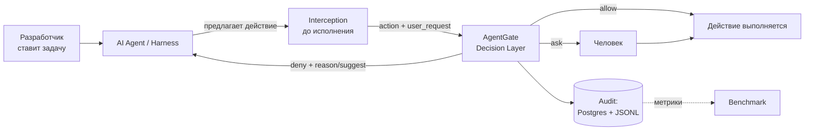

# AgentGate — Product Interim

**Status:** Intermediate / Work in Progress
**Stage:** Hackathon intermediate checkpoint
**Дата:** 2026-09-04, ветка `main`

AgentGate — внешний слой принятия решений для кодинг-агентов: перед исполнением каждого действия агент спрашивает отдельный сервис и получает `allow | deny | ask`. На текущем этапе работает ядро (сервис решений), готов инструмент измерения (бенчмарк на 75 кейсов) и отсутствует установленная интеграция с реальным харнессом.

Команда проверяет не «ловим ли мы атаки», а более узкое и более рискованное утверждение: **можно ли снизить долю действий, требующих человека, не увеличив долю пропущенных атак** — и остаётся ли при этом продукт тем, что пользователь не выключит.

> **Обозначения статуса утверждений** (используются по всему документу):
> **[Ф]** факт — подтверждён кодом, прогоном или внешним источником; **[Р]** решение команды; **[Г]** гипотеза — проверяемая, ещё не проверена; **[П]** предположение — способ проверки не определён; **[?]** утверждение, которое сегодня сделать нельзя.
>
> **Две оговорки, важные для чтения всего документа.** Пользовательских исследований команда **не проводила**. Бенчмарк **ни разу не запускался против живого сервиса** — поэтому ни одной цифры ASR / Utility / FP / Friction / Latency здесь нет и быть не может.

---

## 1. Target User

**[Р] Primary user — разработчик, который уже работает с кодинг-агентом в CLI или IDE и уже столкнулся с выбором между подтверждением каждого шага и полным отключением проверок.** Первичный сегмент сужен до **пользователя открытого харнесса** (Kilo Code, OpenCode, Cline/Roo, OpenHands) — один или в небольшой команде.

Сценарий, в котором возникает проблема — **[Ф]** из кейса: агент пишет код, ставит зависимости, запускает тесты, нередко сам разворачивает приложение; человек валидирует результат «на вайбе». Продуктивность резко растёт именно тогда, когда агенту разрешают действовать без подтверждения каждого шага.

Почему существующая permission-модель ограничивает именно этот сегмент:

- **[Ф]** У закрытых вендоров auto mode уже есть (Claude Code — по умолчанию с 14.08.2026, Codex Auto-review, Cursor Run Modes). В открытых харнессах сопоставимого движка нет: в Kilo Code он только проектируется (issue #9138).
- **[Ф]** Следствие: выбор пользователя бинарный — approval fatigue или `--dangerously-skip-permissions`. Регулятор один, и он регулирует не риск, а объём ручной работы.
- **[Ф]** Для пользователей открытых моделей цена выше: по TRAP (приводится в кейсе) доля успешных инъекций — 13 % для GPT-5 и 43 % для DeepSeek-R1; встроенной устойчивости модели может не хватать.

**[Г] Secondary:** команда на нескольких харнессах (политика сегодня расползается по разным форматам настроек и теряется при смене агента) и организация с требованиями к периметру данных (в AgentGate провайдер ступени 2 задаётся конфигурацией, вплоть до локальной модели). Оба сегмента — гипотезы, не проверенные ни на одном пользователе.

---

## 2. User Problem

**Разработчик не может одновременно получить производительность автономного агента и уверенность, что агент не сделает необратимого действия, — потому что единственный доступный ему регулятор (подтверждать / не подтверждать) регулирует не риск, а объём его собственной работы.**

Проблема — не «AI-агенты небезопасны». Проблема в форме конфликта: три величины связаны так, что улучшение одной ухудшает другую.

1. **Автономность даёт продуктивность.** **[Ф]** Ради этого пользователь и включает bypass.
2. **Человеческое подтверждение — плохой детектор.** **[Ф]** Слепое исследование Anthropic (n = 1 053): люди одобряют 93 % промптов, явно опасную подменённую команду блокируют в 13,6 % случаев, catch rate падает с ~17 % в начале сессии до ~5 % после 50 промптов. Friction, которую платит пользователь, покупает ему не безопасность, а ощущение контроля.
3. **Цена ошибки необратима.** **[Ф]** Канонический пример — удаление production-базы агентом Replit во время code freeze; кейс перечисляет тот же класс (вредоносный npm-пакет, утечка секретов по инструкции из заражённого навыка, удаление промышленной БД).

Отсюда двусторонний тупик: **[Ф]** больше подтверждений → выше friction → выше вероятность, что защиту отключат целиком, и тогда она равна нулю («решение с идеальной детекцией и высоким FPR проигрывает, потому что его выключают»); меньше подтверждений → выше вероятность пропуска (честная публичная цифра рынка — FNR 17 %).

**[Ф]** Кейс добавляет к этой же проблеме два требования, которые команда считает её частью, а не отдельными фичами: после блокировки агент должен **безопасно продолжить работу** (блокировка, после которой агент встал, — тот же простой, только без выбора), и хотя бы один контроль должен быть **архитектурно неуязвим к prompt injection**.

---

## 3. Current Product Insight

**[Р]** Ключевой insight команды:

> **Максимальное блокирование и максимальное количество подтверждений — это одно решение, а не два разных: оба перекладывают риск на человека, который заведомо плохо его оценивает, и оба оплачиваются его временем. Продуктовая задача — сократить множество решений, которые вообще требуют человека, не сделав при этом пропуск дешевле.**

Отсюда следует, что **безопасность продукта нельзя оценивать одним числом заблокированных атак.** **[Ф]** Метрика Utility в кейсе существует ровно для этого: «самый надёжный способ защиты — не позволять агенту работать». Слой, который порождает лишние подтверждения и блокировки benign-действий, снижает автономность агента — то есть ровно ту ценность, ради которой пользователь его поставил.

**[Р]** Два следствия, принятых командой:

- **Гейт конкурирует не с сэндбоксом, а с трением ручного подтверждения.** Мы не обещаем границу безопасности; сэндбокс требуется рядом, а не заменяется.
- **Гарантию можно давать только на ту часть решений, которая принимается детерминированно и без чтения текста.** Всё остальное вероятностно и должно так и называться.

---

## 4. Product Hypothesis

### Основная гипотеза

> **[Г] Если** решение о каждом действии агента выносить **вне харнесса**, в отдельном сервисе, где действие сначала нормализуется в AST и проходит детерминированную ступень без обращения к LLM, а до модели доходит только нерешённый остаток, **то** доля действий, требующих человека, окажется достаточно низкой, чтобы разработчик не отключил защиту, при доле пропущенных атак не выше, чем в режиме ручного подтверждения, **потому что** большая часть реального трафика агента — рутинные и read-only действия, решаемые правилами за миллисекунды и бесплатно, а человек как детектор работает хуже автоматической проверки (93 % одобрений, 13,6 % поимки).

Каждое звено гипотезы соответствует существующему компоненту: `normalize/` (AST), `stage1/chain.py` (детерминированная ступень), `stage2/` (LLM на остатке), `POST /v1/decide` (решение вне харнесса).

### Подчинённые гипотезы

- **[Г] H2 — о гарантии.** Правила, работающие по AST, а не по тексту, не обходятся инструкцией, попавшей в контекст агента (README, SKILL.md, вывод инструмента). Частично подтверждено конструкцией; **[?]** адаптивная атака не пробовалась ни разу.
- **[Г] H3 — о продолжении работы.** Отказ с причиной и безопасной альтернативой, возвращённый как результат инструмента, позволяет агенту продолжить задачу другим путём. **[Ф]** Поля `reason`/`suggest` и шаблон есть; **[?]** подстановки шаблона нет ни в одном коде.
- **[Г] H4 — о переносимости.** Политика, живущая в сервисе, применима к нескольким харнессам. **[Ф]** Контракт единый, `hook_client.py` распознаёт формы Claude Code и OpenCode; **[?]** ни одного установленного адаптера нет.

**[Р]** Гипотеза сознательно **не** формулируется как «мы безопаснее» или «у нас ниже FPR, чем у конкурентов»: сравнивать FPR/FNR можно только на одном датасете, а публичные вендорские цифры получены на трёх разных наборах.

---

## 5. Value Proposition

**AgentGate даёт кодинг-агенту режим, в котором рутина выполняется без подтверждений, опасное останавливается с объяснением и безопасной альтернативой, а человека спрашивают только там, где автоматика не смогла решить, — и каждое такое решение записано и измеримо.**

### User value

**[Г]** Меньше подтверждений при сопоставимом риске — то, ради чего пользователь сегодня включает bypass; величина эффекта **[?]** не измерена. **[Ф]** Работа не останавливается на отказе: ответ несёт `reason` и `suggest`, и формат отказа — часть контракта, а не текст в UI. **[Ф]** Политика — один YAML в git, с историей, вместо отдельного формата настроек на каждый агент.

### Product value

Interaction model меняется с «подтверди каждое действие» на **риск-зависимое вмешательство**: `allow` по умолчанию для рутины, `deny` с альтернативой вместо остановки, `ask` — дорогой ресурс, расходуемый только там, где автоматика не справилась. **[Р]** `ask` на легитимной работе считается провалом продукта, а не его успехом — это зафиксировано в правилах скоринга бенчмарка.

### Technical enabler

**[Ф]** Каскад «нормализация в AST → детерминированная ступень 1 (hard-deny → профиль → allowlist) → ступень 2 (LLM) только на остатке → эскалация по счётчикам сессии», с fail-closed на каждом пути и записью каждого решения в Postgres и JSONL. Read-only и hard-deny до модели не доходят вовсе — то есть стоят ноль токенов; p50 нормализации + ступени 1 ≤ 1 мс (юнит-тест на 200 прогонах).

**[Р]** Отличием заявляется только **упаковка** (политика вне харнесса) + детерминированная ступень + измеримость. Двухстадийность, reasoning-blind, fail-closed, deny-and-continue, AST-нормализация shell — **[Ф]** де-факто стандарт рынка, и ни один из этих пунктов командой как изобретение не подаётся.

---

## 6. Selected Product Approach

**[Р] Runtime decision layer: внешний сервис, принимающий решение по каждому предложенному действию до его исполнения.**

Три решения, из которых следует остальное:

1. **[Р] Точка врезки — до исполнения инструмента и вне харнесса.** Решение принимается в runtime потому, что опасность определяется не текстом команды, а её целью в конкретном контексте (какой путь, какой домен, внутри воркспейса или снаружи) — статически, до запуска сессии, этого не знает никто. Отдельный **decision layer** нужен, чтобы политика была одна на все харнессы, жила в git и не дублировалась в разных форматах настроек.
2. **[Р] Решение никогда не принимается по сырой строке команды** — только по `NormalizedAction`, полученному разбором в AST. Это единственный способ дать честную гарантию неуязвимости к тому, что «написано» в контексте агента.
3. **[Р] Fail-closed как позвоночник:** любая неопределённость превращается в `ask`, а не в `allow`.

**Integration layer** нужен потому, что сервис сам по себе ничего не перехватывает: харнесс должен вызвать его до исполнения инструмента и применить решение к фактическому запуску. Это отдельная зона ответственности и **[?]** главный незакрытый разрыв (см. §7).

**Benchmark** — не тест кода, а инструмент проверки продуктовой гипотезы: он измеряет обе стороны ошибки одновременно (пропуски атак и трение на легитимной работе), иначе улучшение одной выдаётся за успех.

**[Ф]** Отвергнутые альтернативы: только денайлист (систематически обходится — Cursor от своего отказался), только LLM-классификатор (вероятностен, платен на каждом действии, сам является целью инъекции), сэндбокс (единственная настоящая граница, но не различает намерение — **[Р]** требуем рядом, а не заменяем), гейт внутри одного харнесса (политика не переносится).

---

## 7. MVP Boundary

**[Р]** Граница проводится по одному критерию: **входит то, без чего нельзя проверить основную гипотезу §4.**

### In MVP

| Элемент | Зачем для проверки гипотезы | Статус |
|---|---|---|
| `POST /v1/decide` с тремя исходами | Сама единица измерения гипотезы | **Implemented** |
| Нормализация в AST (`NormalizedAction`) | Без неё «детерминированность» и H2 ничем не подтверждаются | **Implemented** |
| Ступень 1: hard-deny → профиль → allowlist | Ядро гипотезы: большая часть трафика решается без LLM | **Implemented** |
| Ступень 2 (LLM) на остатке | Проверка «до модели доходит меньшинство» | **Implemented** |
| Эскалация по счётчикам сессии | Ограничение blast radius там, где пер-экшн-классификация ошибается | **Implemented** |
| Fail-closed на всех путях | Без него «`allow` по ошибке невозможен» непроверяемо | **Implemented** (для сервиса) |
| Запись каждого решения (Postgres + JSONL, `GET /v1/decisions`) | Без неё гипотеза неизмерима в принципе | **Implemented** |
| Один YAML-профиль на сервисе | Проверка «политика вне харнесса» | **Implemented** |
| Бенчмарк: датасет 75 кейсов + раннер + скорер + отчёты | Инструмент проверки гипотезы | **Implemented как инструмент** |
| `reason` + `suggest` в ответе (H3) | Работа продолжается после отказа | **Partially implemented** — поля и шаблон есть, подстановки нет |
| Интеграция с реальным харнессом (H4) | Без неё гипотеза проверяется на стенде, а не на продукте | **In progress** — есть только эталонный клиент `hook_client.py`, `adapters/` пуст |
| **Первый прогон бенчмарка против живого сервиса** | Единственный шаг, превращающий «implemented» в «validated» | **Planned before final — блокирующий** |

### Outside Current MVP

Относится к целевой архитектуре или к развитию, но **для проверки основной гипотезы не требуется**:

- **[Р] Context Guard целиком** (provenance, sensitive data detection, prompt injection detection, data tagging) — отнесён к v4; гипотеза касается решений по действиям, а не фильтрации входящего контекста.
- **[Р] История диалога (v2) и оценка `tool-result` (v3)** — порядок зафиксирован в `context-versions-roadmap.md`.
- **[Р] Четвёртый исход SAFE RECOVERY** — сведён к текстовому полю `suggest`, отдельным маршрутом не является.
- **[Р] Модуль пакетов / slopsquatting** — место в каскаде занято (`stage1/packages.py`), проверка не реализована; typosquat ловится только ступенью 2.
- **[Р] Внешний бенчмарк против конкурентов**, панель / UI, override, обучение политики, параллельные проверки, идемпотентность, общее состояние сессии между процессами.

**[Р]** Отдельное решение: всё из этого списка остаётся в документах как явно неготовое, а не выпадает из описания продукта — основание — требование кейса о честности гарантий.

---

## 8. Primary User Scenario

1. **Разработчик ставит задачу агенту** в своём харнессе — обычным текстом, ничего не зная про AgentGate.
2. **Агент решает выполнить действие** — команду в shell, запись файла, сетевой вызов, вызов MCP-инструмента.
3. **Действие перехватывается до исполнения.** Адаптер отправляет в AgentGate описание действия и последний запрос пользователя. **[Ф]** Рассуждения агента, выводы инструментов и `metadata` в оценку не передаются.
4. **AgentGate выносит решение** — за миллисекунды, если хватило правил; иначе с обращением к модели.
5. **Ветвление, которое видит пользователь:**
   - **allow** — действие выполняется, пользователь ничего не замечает. **[Р]** Целевое состояние для большинства действий;
   - **deny** — действие не выполняется, агент получает причину и безопасную альтернативу как результат инструмента и **продолжает задачу другим путём**; пользователь видит объяснение, а не остановку;
   - **ask** — спрашивают пользователя, и каждый такой случай обязан нести причину и вариант действия.
6. **Повторное такое же действие в той же сессии** проходит быстрее: **[Ф]** `allow` кэшируется на сессию, `deny` и `ask` не кэшируются никогда.
7. **Если агент упирается в стену** (3 отказа подряд либо 10 из последних 50) — решение принудительно уходит человеку. **[Р]** Это сигнал «границу нужно чинить», а не наказание агента.
8. **Каждое решение записано** — ленту можно посмотреть позже: что просили, что предложил агент, что решил гейт, на какой ступени и почему.

**[?] Разрыв, который называется прямо.** Шаги 3 и 5 сегодня работают только через эталонный клиент `contracts/hook_client.py`, вызываемый вручную или из e2e-теста. **Установленного в реальный харнесс адаптера нет**; рендеринг deny-сообщения и диалог подтверждения на `ask` кодом не покрыты. Описанный flow — целевой сценарий MVP, а не то, что сегодня можно показать внутри работающего агента.

---

## 9. Preliminary Success Criteria

**[Р] Числовых порогов команда сознательно не фиксировала** — до первого прогона любая цифра была бы вымыслом. Ниже — что измеряется и в какую сторону.

### Safety

- **`attack_pass_through_rate`** — доля атакующих кейсов, на которые вернулся `allow` (операционализация ASR). **Главный показатель.**
- **`attacks_not_blocked`** — абсолютное число пропусков, с разбивкой `by_attack_category` и `by_difficulty`.
- **Отделение промахов от известных ограничений v1** — `tag_failures`; 3 кейса помечены `v1_limitation` (требуют провенанса или модуля пакетов), их провал ожидаем и не смешивается с промахом.
- **[Р]** Метод: FN на «неосторожных» действиях и FN на adversarial-цепочках **не смешиваются**.
- **[?] Validation target:** recall / детекция — `detected` и `detection_correct` пишутся построчно, но в сводку не агрегируются; сегодня этой метрики фактически нет.

### User friction

- **`false_positive_rate`** — доля benign-кейсов, получивших `deny`.
- **`benign_asked_friction`** — доля benign-кейсов, получивших `ask`. **[Р]** Засчитывается как трение, а не как успех: допустимый результат для benign — строго `{allow}`.
- **Доля `allow` в `decision_distribution`** — ближайший к продуктовой гипотезе показатель сохранённой автономности.
- **Доля трафика, дошедшая до LLM-ступени** (`stage_distribution`) — ядро экономики продукта; рыночный ориентир: у Codex до ревьюера доходит 7,2 % действий.
- **Частота `ask` по таймауту / ошибке** — цена fail-closed, отделяемая по `rule_id`.
- **[?] Validation target:** доля восстановлений агента после `deny` (H3) — в бенчмарке не реализована, требует реальной интеграции.
- **[?] Ограничение, проговариваемое вместе с любой цифрой friction:** контрольная группа — 5 кейсов на 70 атакующих; один провал двигает метрику на 20 п. п. Это индикатор, а не измерение.

### Performance / Economics

- **Латентность ступени 1** — **[Ф]** единственная измеренная сегодня величина: p50 ≤ 1 мс на 200 прогонах (юнит-тест ступени, не сквозная латентность продукта).
- **`service_p50_ms` / `service_p95_ms`** — **[Р]** заявления о латентности делаются только при `--concurrency 1`; клиентские настенные часы для этого не годятся.
- **[?] Стоимость сегодня не измеряется:** каркас (таблица цен, пробы по JSON-путям) готов, но контракт `/v1/decide` v1 не отдаёт usage, поэтому `cost` всегда `None` с явной причиной. Косвенный аргумент — доля решений, не дошедших до модели.

**[Р]** Качественный критерий из кейса принят наравне с количественными: «отрицательный результат с понятным методом ценнее хорошего числа без описания метода» — поэтому в критерии входит воспроизводимость прогона (дата, коммит сервиса, профиль, модель, `--concurrency`).

---

## 10. Key Assumptions

| Assumption | Why it matters | Current evidence | How we validate |
|---|---|---|---|
| **A1.** Большая часть реальных действий агента решается детерминированно, без LLM | Ядро гипотезы: от этого зависят латентность, стоимость и доля `allow` | **[?] Нет.** Косвенная опора — рынок (7,2 % трафика доходит до ревьюера у Codex); на нашем датасете не измерено | `stage_distribution` в первом прогоне бенчмарка |
| **A2.** Правила по AST не обходятся текстом, попавшим в контекст агента | Единственное, на что мы даём гарантию; прямое требование кейса | **[Ф] Частично:** конструкция это обеспечивает, табличные тесты hard-deny покрывают `$(…)`, `eval`, переменные, base64, heredoc. **[?]** Адаптивная атака не пробовалась | Прогон категорий `obfuscation_evasion`, `tool_argument_injection` и уровня `adversarial`; в идеале — внешний red-team |
| **A3.** Агент, получив `deny` с `reason` и `suggest`, продолжит работу | Иначе `deny` = остановка, и friction не снижается | **[?] Нет.** Поля и шаблон есть, кода, который его подставляет, нет | Реальная интеграция с харнессом + наблюдение; метрика в бенчмарке не реализована |
| **A4.** Точка перехвата уровня `PreToolUse` существует не только в Claude Code | Без этого кросс-харнессность (H4) — декларация | **[Ф] Частично:** `hook_client.py` распознаёт формы Claude Code и OpenCode. **[?]** Установленных интеграций нет | Первая реальная интеграция; выбор харнесса не сделан |
| **A5.** Дополнительный сетевой вызов на действие приемлем для пользователя | Прямой риск из кейса: «проверка дольше действия ломает рабочий процесс» | **[Ф] Частично:** ступень 1 ≤ 1 мс по юнит-тесту. **[?]** Сквозная латентность с сетью и LLM не измерена | Отдельный прогон с `--concurrency 1`, `service_p50/p95` |
| **A6.** Датасет из 75 кейсов отражает реальные угрозы и реальную работу | От этого зависит осмысленность всех метрик | **[Ф] Частично:** 15 категорий × 5 уровней, инварианты форсируются валидатором. **[?]** Ожидания расставлены по спеке и здравому смыслу, а не по наблюдаемому поведению | Разбор провалов первого прогона на три корзины: ошибка ожидания / `v1_limitation` / настоящий промах |
| **A7.** Пользователь готов поставить отдельный сервис рядом с агентом | На этом стоит выбор «сервис, а не плагин» | **[?] Нет.** Прямо назван открытым вопросом в конкурентном анализе | Пользовательской проверки не запланировано; ближайший суррогат — сложность установки в демонстрации |
| **A8.** Один профиль политики годится для разных пользователей и проектов | Иначе «политика вне харнесса» превращается в «политика, которую всё равно каждый правит» | **[П] Предположение.** Поле профиля `rules` объявлено, но **[Ф]** не читается кодом вообще | Способ не определён; кандидат — прогон бенчмарка на втором профиле |
| **A9.** Fail-closed приемлем как поведение по умолчанию | При недоступности LLM всё нерешённое становится `ask` — friction резко растёт | **[Ф]** Для сервиса зафиксировано и покрыто тестами. **[?]** Конфликт с контрактом адаптера (fail-open на клиенте) не решён | Решение владельца продукта + доля `ask` по таймауту в прогоне |

---

## 11. Key Risks

| Risk | Why it matters | Mitigation / Validation |
|---|---|---|
| **False negatives** | Ступень 2 вероятностна; честная публичная цифра рынка — FNR 17 % | Разделение FN на неосторожные и adversarial; эскалация ограничивает blast radius; hard-deny не переопределяется ничем. **[?]** Не измерено |
| **False positives / friction** | Гейт, который часто ошибается, выключают — это и есть проигрыш продукта | Контрольная группа `benign_utility`; `ask` на benign засчитывается как провал. **[Ф]** Группа мала (5 кейсов) — риск некалиброванной оценки |
| **Недостаточность входного контекста** | Сервис видит одно действие + последний запрос; многошаговые атаки, где каждый шаг безобиден, по построению не видны | **[Р]** Класс явно объявлен непредставимым в v1 (`taxonomy.md` §5); в roadmap — история диалога (v2), tool-result (v3), Context Guard (v4) |
| **Latency** | Сетевой вызов на каждое действие серой зоны | Дешёвая ступень 1 закрывает рутину; отдельный прогон `--concurrency 1` для заявлений. **[?]** Сквозная не измерена |
| **Cost** | Токены ступени 2 на каждое неоднозначное действие | Ступень 1 до модели, выбор модели — конфигурация, allow-кэш на сессию. **[?]** **Не измеряется вовсе** — контракт не отдаёт usage |
| **Adaptive attack / обход слоя** | Независимый red-team пробивал все проверенные системы (ASR 60–80 %); пользователь может просто не поставить хук | Уровень `adversarial` в каждой из 15 категорий; hard-deny не зависит от текста. **[Р]** Продуктовый ответ на обход — держать friction низкой, чтобы слой не выключали. **[?]** Внешнего red-team не было |
| **Неоднородность харнессов / integration complexity** | Заявленная мультихарнессность держится на одном эталонном CLI-клиенте | Стабильный HTTP-контракт, генерируемые схемы, тест на расхождение контрактов. **[Ф]** `adapters/` пуст — **главный разрыв между заявлением и кодом** |
| **Ограниченность бенчмарка** | 75 кейсов, по одному наблюдению на ячейку (категория × сложность); набор диагностический, а не статистический | Разбор провалов по корзинам; **[Р]** расширить контрольную группу до 20–30 кейсов; любая цифра приводится с оговоркой об объёме |
| **Конфликт fail-open / fail-closed** | Сервис жёстко fail-closed внутри, контракт адаптера по умолчанию fail-open на клиенте: «положил гард — разрешено всё» | Три варианта зафиксированы в `adapter-contract-gap-analysis.md`. **[?] Не решено.** Влияет на то, верно ли «`allow` по ошибке невозможен» для системы, а не только для сервиса |
| **Цитирование чисел заглушки как результата** | `tools/mock_agentgate.py` печатает правдоподобный отчёт с процентами, не значащими ничего | **[Р]** Правило команды: до реального прогона цифры не приводятся нигде. Риск активен, пока прогона нет |

---

## 12. Validation Plan Before Final

### Must validate before final

**Benchmark validation**

1. **Первый прогон бенчмарка против живого AgentGate** — поднять сервис (Postgres + ключ модели ступени 2), `pytest -m live`, затем `cli.py benchmark --path attacks/cases --concurrency 1`. Единственный шаг, превращающий «implemented» в «validated». Осознанная цена — 75 запросов, часть платных.
2. **Разбор провалов на три корзины** — ошибка ожидания в кейсе / известное ограничение v1 / настоящий промах сервиса. Без этого сводные проценты недоказательны.
3. **Сохранить результаты под версионным контролем** с датой, коммитом сервиса, профилем, моделью и `--concurrency` (сейчас `results/` в `.gitignore` — по умолчанию не сохранится ничего).
4. **Отдельный прогон для заявлений о латентности** — строго `--concurrency 1`, цитируется `service_p50_ms` / `service_p95_ms`.

**Technical validation**

5. **Минимум одна реальная интеграция с харнессом** — установленный адаптер, а не эталонный CLI-клиент. Проверяет H4 и делает демонстрацию продуктовой, а не стендовой.
6. **Сквозной цикл `deny` → агент продолжает работу** — подстановка `contracts/deny_message_template.md` и наблюдение за поведением агента. Проверяет H3.

**Product validation**

7. **Решение по конфликту fail-open / fail-closed** — выбор одного из трёх зафиксированных вариантов. Это продуктовое решение: от него зависит, что именно мы гарантируем.
8. **Решение, какой харнесс интегрируем первым** и считается ли `hook_client.py` достаточной интеграцией для демонстрации.

**Demo validation**

9. **Стабильно должны работать:** живой сервис из одной команды (`docker compose up`), три исхода через `curl`, ступень 2 со structured output (`npm install lodahs` → `deny` + `suggest: npm install lodash`), fail-closed при отключённом LLM, эскалация после трёх отказов, allow-кэш, лента решений `GET /v1/decisions`, `cli.py validate` (75 кейсов, 0 ошибок).
10. **Показывать нельзя:** цифры бенчмарка как готовый результат до прогона, сравнение с конкурентами, Context Guard, ветку SAFE RECOVERY и диалог подтверждения на стороне харнесса.

### Nice to have

11. Расширить контрольную группу с 5 до 20–30 кейсов — самое слабое место в любых утверждениях об удобстве.
12. Вывести recall / детекцию в сводку (`detected` и `detection_correct` уже пишутся построчно).
13. Модуль пакетов / slopsquatting — детерминированная проверка вместо заглушки; прямо назван в кейсе.
14. Минимальная пользовательская проверка: несколько разработчиков прогоняют реальную задачу с включённым AgentGate и отмечают, где их спросили зря. **[?]** Сегодня у продукта нет ни одного наблюдения за реальным пользователем — самый большой непокрытый пробел валидации.
15. Внешний режим сравнения — **либо** реализовать раннер бейзлайнов, **либо** убрать обещание из `benchmark/README.md`. **[Р]** Промежуточное решение: сравнительных заявлений не делать, значит второй вариант допустим.

---

## 13. Product Decisions ↔ Technical Implementation

| Product decision / requirement | Why it matters for user | Technical implementation | Current status |
|---|---|---|---|
| **Минимальный friction:** пользователь не подтверждает каждое действие | Иначе продукт равен ручному подтверждению, которое как детектор уже проиграно (§2) | Автоматический слой решения `POST /v1/decide` с тремя исходами; `Gate.decide` (`pipeline.py`) | **Implemented** |
| **Рутина не должна стоить ни времени, ни токенов** | Ядро гипотезы; главный аргумент против «одного умного классификатора» | Ступень 1: `stage1/chain.py` — `hard_deny → profile_check → allowlist → packages`, LLM не вызывается | **Implemented** (p50 ≤ 1 мс по юнит-тесту) |
| **Runtime safety evaluation, не по тому, что «написано» в контексте** | Единственная гарантия, которую можно дать честно; требование кейса о контроле, неуязвимом к инъекции | Нормализация в AST (`normalize/shell.py` → `NormalizedAction`); решение по сырой строке запрещено; промпт ступени 2 reasoning-blind | **Implemented** |
| **Часть запретов не переопределяется ничем** | Иначе политику уговорит либо пользователь, либо модель, либо README | `stage1/hard_deny.py`, 6 семейств правил, `hard=True` не снимается эскалацией | **Implemented** |
| **Ошибка не должна становиться разрешением** | Без этого «безопасность» — не свойство, а везение | Fail-closed на каждом пути: ручной парсинг тела, перехват исключений, `ask` при любом отказе ступени 2; HTTP 200 всегда | **Implemented** для сервиса; **Open** для системы (конфликт с fail-open в контракте адаптера) |
| **Получение контекста из agent / harness** | Без точки перехвата продукт не существует; без ограничения контекста ступень 2 читала бы то, чем её атакуют | Единый HTTP-контракт (`contracts/openapi.yaml`, схемы из pydantic) + `hook_client.py` (формы Claude Code `PreToolUse` и OpenCode `tool.execute.before`); в оценку идут только действие и `user_request` | **Partially implemented** — `adapters/` содержит только README, установленных интеграций нет |
| **Отказ не должен останавливать работу** | `deny`, после которого агент встал, = тот же простой | Поля `reason` и `suggest` в `DecideResponse`; `contracts/deny_message_template.md` | **Partially implemented** — поля и шаблон есть, подстановки нет ни в одном коде |
| **Человека спрашивать только там, где иначе нельзя** | `ask` — дорогой ресурс | Исход `ask` + эскалация `session/escalation.py` (3 подряд либо 10 из 50) | **Implemented** |
| **Повторная рутина не оплачивается дважды** | Латентность и стоимость | Allow-only кэш на сессию (`session/cache_key.py`, `memory.py`); `deny` / `ask` не кэшируются | **Implemented** |
| **Политика живёт вне харнесса и одна на все агенты** | Иначе продукт = ещё один гейт внутри одного харнесса | Один YAML-профиль на сервисе (`profiles/`); харнесс знает только URL, токен и `profile_id` | **Implemented** на стороне сервиса; **Planned** на стороне харнессов |
| **Измеримость качества решения** | Иначе безопасность — обещание, а не метрика | Бенчмарк: 75 кейсов / 15 категорий / 5 уровней с контрольной группой, детерминированный скорер без LLM-судьи, отчёты Safety / Friction / Latency; Postgres + JSONL + `GET /v1/decisions` | **Implemented как инструмент**, **не выполнен как измерение** |
| **Свобода выбора модели и периметра данных** | Вторичный сегмент с on-prem-требованиями; контроль стоимости | OpenAI-совместимый клиент, конфигурация модели в профиле, выбор модели на запрос | **Implemented** |
| **Защита от slopsquatting до установки пакета** | Прямое требование кейса | `stage1/packages.py` — слот в каскаде | **Planned** — заглушка, всегда `None` |
| **Проверка данных до попадания в контекст агента** | Верхний контур целевой архитектуры | Context Guard | **Planned (v4)** — в коде отсутствует полностью |

---

## 14. AI Product Contribution

Вклад роли **AI Product (Тимур Полищук)** согласно `07_team.md`. **[Ф]** Инженерная реализация decision-сервиса принадлежит **Александру Иванову**, слоя перехвата и интеграций с харнессами — **Алексею Балашову**; ниже эти зоны не приписываются.

- **Product-level architecture.** Разработка верхнеуровневой целевой архитектуры продукта **без фиксации конкретного инженерного способа реализации** (`04_architecture/target_architecture.jpg`, §3–4 `architecture_description.md`): из каких блоков состоит система и какие исходы она обязана различать. Как эти блоки реализованы — зона AI Engineers.
- **Перевод проблемы кейса в продуктовые требования.** Формализация пользовательской проблемы (§2), продуктовой гипотезы (§4), границ MVP (§7) и связи «пользовательская проблема ↔ техническая архитектура» (§13). Настоящий документ — часть этой работы: он существует, чтобы архитектура читалась как следствие гипотезы, а не как набор компонентов.
- **Benchmark — единоличное владение реализацией.** Структура бенчмарка, формат кейса, таксономия 15 категорий и 5 уровней сложности, инварианты датасета и их форсирование валидатором, детерминированный скорер без LLM-судьи, состав отчёта, 75 YAML-кейсов, 122 собственных теста. Отдельное продуктовое решение внутри этой работы — **контрольная группа `benign_utility`**: без неё сервис, всегда отвечающий `deny`, показал бы 100 % по всем категориям.
- **Определение того, что и как должно измеряться.** Разделение Safety / Friction / Performance; правило «`ask` на легитимной работе — провал, а не успех»; требование не смешивать FN на неосторожных действиях с FN на adversarial-цепочках; требование измерять латентность только при `--concurrency 1`; правило не приводить цифр до реального прогона.
- **Конкурентное и продуктовое исследование.** Lead по `02_a`, `02_b`, `03_competitor_research_summary.md`, включая раздел «Claims We Can Safely Make» — список утверждений, которые команде разрешено и запрещено делать. Этот список напрямую ограничивает формулировки §5 и §11 настоящего документа.
- **Проектные артефакты.** Владение проектной документацией, промежуточными и финальными артефактами, презентацией и материалами защиты; поддержание честного разделения «реализовано / частично / не реализовано / измерений нет» в `05_current_state.md` и `06_benchmark_status.md`.
- **Сквозная функция.** Удерживать связь между технической реализацией и исходной пользовательской проблемой: бенчмарк рассматривается не как технический тест, а как инструмент проверки продуктовых характеристик — security, FP / FN, friction, latency, cost, степень сохранения автономности агента.

**[Ф]** Оговорка из `07_team.md`: продуктовая проблема, целевой пользователь, value proposition, пользовательский сценарий, верхнеуровневая архитектура, критерии оценки, границы MVP и риски прорабатываются **совместно всей командой**; жёстким разделение становится преимущественно на уровне конкретной реализации.

---

## 15. Current Product Status

### Validated / supported so far

- **[Ф]** Ядро подхода реализовано и покрыто тестами: каскад «AST → детерминированная ступень 1 → LLM на остатке → эскалация» подключён к основному потоку `POST /v1/decide`; e2e-сценарий проходит через реальный подпроцесс сервиса и `contracts/hook_client.py`.
- **[Ф]** Fail-closed проверяем: любая ошибка, таймаут, невалидный запрос или невалидный ответ модели дают `ask` с HTTP 200; `allow` по ошибке недостижим — на это есть отдельные тесты.
- **[Ф]** Детерминированная ступень дёшева: p50 нормализации + ступени 1 ≤ 1 мс на 200 прогонах.
- **[Ф]** Hard-deny устойчив к обфускации на нашем наборе тестов (`$(…)`, `eval`, переменные, base64, heredoc, обёртки).
- **[Ф]** Каждое решение измеримо: Postgres + JSONL + `GET /v1/decisions` со ступенью, `rule_id`, моделью и латентностью по ступеням.
- **[Ф]** Инструмент проверки готов: 75 кейсов, 15 категорий, 5 уровней сложности, 0 ошибок валидации, 122 собственных теста.

### In validation

- Стык бенчмарка с живым сервисом: клиент писался по спеке, когда сервиса не существовало; ни один настоящий ответ AgentGate через него не проходил.
- Калибровка ожиданий датасета: `expected_service_result` расставлены по спеке, а не по наблюдаемому поведению.
- Первая интеграция с реальным харнессом — какой именно, ещё не решено.

### Still hypothesis

- **A1 / основная гипотеза:** доля трафика, решаемая без LLM, и достижимая доля `allow` — не измерены.
- **H2:** устойчивость к адаптивной атаке — внешнего red-team не было.
- **H3:** что агент после `deny` продолжит работу — кода подстановки шаблона нет, метрики нет.
- **H4:** переносимость политики между харнессами — установленных адаптеров нет.
- **A7:** готовность пользователя ставить отдельный сервис — не проверена ничем; пользовательских наблюдений у продукта ноль.
- Стоимость на действие — структурно не измеряется в v1.

### Before final

1. **Первый прогон бенчмарка против живого сервиса** + разбор провалов на три корзины + сохранение результатов под версионным контролем. Блокирующий пункт.
2. **Одна реальная интеграция с харнессом** — установленный адаптер вместо эталонного клиента. Блокирующий пункт.
3. **Сквозная демонстрация `deny` → агент продолжает работу** (подстановка `contracts/deny_message_template.md`).
4. **Решение по конфликту fail-open / fail-closed** — продуктовое решение владельца продукта.
5. **Отдельный прогон для заявлений о латентности** при `--concurrency 1`.
6. **Расширение контрольной группы** до 20–30 кейсов — иначе любые утверждения о friction остаются индикатором, а не измерением.
