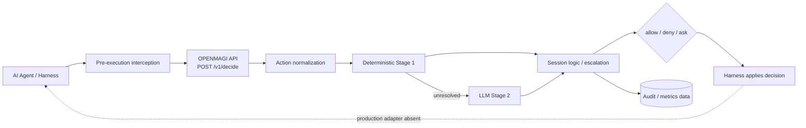

# OPENMAGI — Project Interim

**Status:** Intermediate / Work in Progress  
**Stage:** Hackathon intermediate checkpoint  
**Date:** 2026-09-04  
**Branch:** `main`

OPENMAGI — внешний runtime decision layer для проверки действий AI coding agent до их исполнения. В репозитории реализовано ядро decision service: HTTP API, структурная нормализация, детерминированная Stage 1, LLM Stage 2, сессионная эскалация, allow-кэш и аудит в Postgres/JSONL. Также реализован и офлайн протестирован benchmark-инструментарий на 75 кейсах; валидатор подтверждает 15 категорий и пять уровней сложности без ошибок. Интеграционный слой пока представлен контрактами и reference hook client, распознающим payload двух harnesses, но ни одного установленного production harness adapter в репозитории нет. Поэтому главный технический gap — отсутствие реального pre-execution enforcement: сервис возвращает `allow | deny | ask`, но фактическое применение решения агентом не доказано. Главный ещё не проведённый эксперимент — первый benchmark run против живого OPENMAGI с реальной Stage 2; сохранённых результатов такого прогона нет. Следовательно, решение имеет статусы **Implemented** и **Tested** по отдельным компонентам, но не **Validated** как продуктовая система.

> Статусы в документе: **Implemented** — компонент включён в основной рабочий поток; **Tested** — проверен собственными тестами; **Validated** — подтверждён живой интеграцией или реальным экспериментом; **Partial**, **In progress**, **Planned**, **Target only**, **Unknown** — соответственно частичная реализация, текущая работа, план, только целевая архитектура и неподтверждённое состояние.

---

## 1. Project Summary

OPENMAGI — отдельный сетевой сервис между AI coding harness и инструментами/операционной средой. Harness должен перехватить предложенный tool call до исполнения, привести его к контракту OPENMAGI, получить решение `allow | deny | ask` и применить его; сам сервис команды не исполняет и физически заблокировать обход harness не может.

Проект состоит из трёх подсистем:

1. **Decision service** — нормализует действие, выполняет детерминированные проверки, при необходимости вызывает LLM-классификатор, применяет сессионную логику и сохраняет решение.
2. **Harness interception / integration layer** — переводит события конкретных harnesses в единый API-контракт и должен обеспечивать enforcement решения. Сегодня этот слой **Partial**: есть схемы и reference client, но нет установленного adapter.
3. **Benchmark** — отправляет стандартизированные пары `user_request + proposed tool call` в публичный API, детерминированно оценивает ответ и строит отчёты. Инструмент **Implemented + Tested**, но ещё не использован для живого измерения OPENMAGI.

Evidence: `service/agentgate/pipeline.py`, `contracts/hook_client.py`, `adapters/README.md`, `benchmark/runner/executor.py`, `benchmark/evaluator/scorer.py`.

---

## 2. Problem & Current Task Definition

Исходный кейс описывает конфликт между approval fatigue и небезопасным bypass-режимом: ручное подтверждение каждого шага снижает продуктивность, а полная автономия оставляет риск разрушительных действий, утечки секретов, prompt injection и установки вредоносных или ошибочно названных пакетов. Кейс отдельно требует оценивать не только защиту от атак, но и Utility, false positives, Friction и Latency, а после блокировки сохранять возможность безопасно продолжить работу. Source: `docs/project-context/01_hackathon_case.md`.

Актуальная инженерная задача команды: построить внешний runtime decision layer, который получает предложенное действие до исполнения, классифицирует его с минимальным вмешательством человека и возвращает решение, применимое harness. Это три связанные задачи:

- **decision-making:** структурно разобрать действие и получить `allow | deny | ask` через каскад deterministic → LLM → session escalation;
- **interception / integration:** гарантированно вызвать OPENMAGI до действия и исполнить его вердикт, включая `deny`, `ask` и безопасное продолжение;
- **evaluation / benchmark:** воспроизводимо измерить пропуски атак, ложные блокировки/запросы человеку, распределение стадий и задержку.

Продуктовая мотивация и гипотезы подробно зафиксированы отдельно в `docs/project-context/artifacts/PRODUCT_INTERIM.md`; здесь они не дублируются.

---

## 3. Selected Technical Approach



### Action normalization

Действие переводится в `NormalizedAction`, чтобы правила и LLM работали с argv, редиректами, путями, доменами, MCP-вызовом и флагами неоднозначности, а не сравнивали префикс сырой строки. Для `shell` используется AST `bashlex`; для `file_read`/`file_write` резолвятся пути, для `network` нормализуются переданные домены, для `mcp_call` переносится структурный MCP-блок. Поддерживаемые API-типы: `shell`, `file_write`, `file_read`, `network`, `mcp_call`. Непарсибельный shell получает `unparseable=True`, пустые структурные коллекции и далее `ask`, без вызова LLM. Evidence: `service/agentgate/api/schemas.py`, `service/agentgate/normalize/__init__.py`, `service/agentgate/normalize/shell.py`, `service/agentgate/normalize/model.py`.

Поддержка формата в API не равна полноте интеграции: текущий `contracts/hook_client.py` не извлекает домен из `WebFetch/WebSearch` в `args.domains` и передаёт пустой `mcp.arguments`; service-схема требует `raw` только для `shell`, но не требует непустых tool-specific аргументов. Поэтому network/MCP normalization существует, но полнота данных от reference client — **Partial**.

### Deterministic stage

Stage 1 выполняется без LLM в фиксированном порядке: `hard_deny → profile_check → allowlist → packages`; первый непустой результат завершает каскад. Hard-deny покрывает шесть семейств: эксфильтрацию, download-to-exec, разрушительные операции, запись в защищённые пути, повышение привилегий/firewall и force-push в защищённые ветки. Он может вернуть финальный `deny`, неоднозначный `ask` или передать действие дальше. Profile check применяет ограничения путей и доменов; allowlist разрешает ограниченный набор read-only операций, безопасных git-подкоманд и заданных профилем префиксов. Слой нужен для предсказуемых решений без стоимости и задержки LLM; его гарантии ограничены распознанными структурными правилами, а не всей безопасностью системы. `packages` пока заглушка. Evidence: `service/agentgate/stage1/chain.py`, `hard_deny.py`, `profile_check.py`, `allowlist.py`, `packages.py`.

### LLM stage

Stage 2 вызывается только когда Stage 1 не вынесла решение; непарсибельное действие до неё не допускается. Модель получает закрытый набор: профиль и prose-политику, последний `user_request`, структурированное действие, флаги и фиксированную отметку о Stage 1. Сырые `metadata`, reasoning агента, tool results и raw shell string в prompt не входят. Клиент делает один запрос к OpenAI-compatible `/chat/completions`, без retry, с таймаутом из профиля и strict structured-output schema; результат `A | D | U` отображается в `allow | deny | ask`. Это вероятностная ступень, зависящая от внешнего provider и качества неполного контекста; живым benchmark она ещё не проверена. Evidence: `service/agentgate/stage2/prompt.py`, `client.py`, `schema.py`, `run.py`, `service/profiles/default-dev.yaml`.

### Session logic

Реализованы:

- счётчики `deny_consecutive`, `deny_total`, `decisions_total` и окно последних 50 решений;
- эскалация в `ask` при трёх предыдущих deny подряд или 10 deny из последних 50; hard-deny не переопределяется;
- allow-only cache с TTL: ключ включает `profile_hash`, `action_hash` и `user_request`; `deny`/`ask` не кэшируются;
- восстановление сессий и валидных записей cache из Postgres при старте.

Горячее состояние остаётся in-memory на один процесс; Postgres не является распределённым координатором между workers/instances. Evidence: `service/agentgate/session/state.py`, `escalation.py`, `memory.py`, `cache_key.py`, `service/agentgate/__main__.py`.

### Fail-closed behavior

На стороне decision service невалидный JSON/схема, неизвестный профиль/модель, исключение pipeline, непарсибельное действие, timeout, HTTP error, пустой или невалидный ответ Stage 2 превращаются в `ask`, а не `allow`. Ошибка проверки выданного API-ключа означает отсутствие совпадения и 401. Ошибки фоновой записи аудита не меняют уже выданное решение, но могут привести к потере записи. `/healthz` при проблеме БД возвращает `degraded`, однако HTTP status остаётся 200.

Системная fail-closed гарантия **не подтверждена**. Reference client при недоступности сервиса печатает `ask` и завершает работу с кодом 3, но production adapter отсутствует, а фактическая интерпретация `ask`/кода 3 конкретным harness не реализована. Более широкий adapter contract отдельно допускает fail-open по умолчанию. Evidence: `service/agentgate/api/app.py`, `service/agentgate/stage2/run.py`, `contracts/hook_client.py`, `contracts/README.md`, `docs/superpowers/service/specs/adapter-contract-gap-analysis.md`.

### Audit / observability

После ответа background task пишет append-only JSONL и Postgres. В `decisions` сохраняются raw и normalized action, `user_request`, профиль/hash, verdict, reason/suggest, stage, rule, model и сырой model response, latency, error, cached и metadata; отдельно хранятся sessions, allow cache и API keys. Просмотр доступен через `GET /v1/decisions` с фильтрами и cursor pagination. Prometheus/OpenTelemetry, alerts и отдельная readiness probe отсутствуют; `healthz.llm` всегда `null`. Evidence: `service/agentgate/store/models.py`, `store/repo.py`, `log/jsonl.py`, `api/app.py`, `migrations/versions/0001_init.py`, `0002_api_keys.py`.

---

## 4. Target Architecture vs Current Architecture

### Target architecture

Полная схема добавляет до агента Context Guard (provenance, sensitive-data и prompt-injection detection, validation/tagging), Action Analyzer с explicit expected impact, Policy & Risk Engine, богатое session state, четыре ветви `BLOCK | SAFE RECOVERY | ASK USER | ALLOW` и human loop `Approve | Reject | Comment`. Roadmap раскладывает контекст на v2 (dialogue history), v3 (tool-result/provenance) и v4 (Context Guard/mask). Это желаемое состояние, не обязательство к финалу хакатона. Evidence: `docs/project-context/04_architecture/target_architecture.jpg`, `architecture_description.md`, `docs/superpowers/service/specs/context-versions-roadmap.md`.

### Current architecture

Сегодня существует нижний контур: request одного действия + последний запрос пользователя → normalization → deterministic Stage 1 → LLM Stage 2 → session escalation/cache → три исхода → background audit. Вызов со стороны harness показан reference client и e2e-тестом, но не установлен в реальный agent runtime.

| Component | Target role | Current state | Gap |
| --------- | ----------- | ------------- | --- |
| Decision Service | Единая runtime-точка решения | **Implemented / Tested** | Не **Validated** живой интеграцией/benchmark |
| Action normalization | Полный Action Analyzer, включая impact | **Implemented / Tested** для пяти tool types | Нет explicit expected impact; tool-specific вход может быть пустым |
| Deterministic Stage 1 | Hard rules и быстрый безопасный путь | **Implemented / Tested** | Windows path behavior ломает часть тестов и решений |
| LLM Stage 2 | AI risk classifier на остатке | **Implemented / Tested** на mocks/fake LLM | Нет live-provider/benchmark validation; один вызов без retry |
| Policy / profiles | Централизованная политика | **Implemented** | `Profile.rules` объявлено, но не используется; org/user hierarchy нет |
| Session logic | Сессионный риск, бюджеты и escalation | **Partial** | Есть deny counters/cache; нет Files/Secrets/Destinations/Uploads/Cost/Risk Score и distributed state |
| Audit / persistence | Полный журнал и метрики | **Implemented / Tested** | Background best-effort запись; нет tracing/metrics и key attribution |
| Harness interception | Вызов до tool execution | **Partial** | Есть reference CLI contract; регистрации в реальном harness нет |
| Harness adapters | Применение решений в разных harnesses | **Planned** | `adapters/` содержит только README |
| Safe recovery / deny continuation | Запретить опасное и продолжить безопасно | **Partial / Target only** | Есть `suggest` и шаблон; нет рендеринга, retry/continuation и отдельной ветви SAFE RECOVERY |
| Ask / user decision | Approve / Reject / Comment | **Partial / Target only** | Сервис возвращает `ask`; UI и обратный канал отсутствуют |
| Benchmark | Проверка качества и friction | **Implemented + Tested** как инструмент | Живого run и сохранённых результатов нет |
| Context Guard | Проверять данные до контекста агента | **Target only, roadmap v4** | Реализации нет |
| Dialogue history | Контекст прошлых сообщений | **Target only, roadmap v2** | API-полей нет |
| Tool-result / provenance | Проверять входящий результат tool | **Target only, roadmap v3** | Только pre-execution direction |
| Package/slopsquatting protection | Детерминированная проверка до install | **Planned / stub** | `check_packages()` всегда возвращает `None` |
| Parallel checks | Минимизировать дополнительную latency | **Target only** | Pipeline последовательный с short-circuit |
| Idempotency | Не учитывать retry как новое действие | **Target only** | Повтор двигает session counters и пишет второй audit record |

---

## 5. Implemented Components

### 5.1 Decision Service

- **API:** `POST /v1/decide`, `GET /v1/decisions`, `GET /v1/profiles/{profile_id}`, `GET /healthz`; контрактные модели имеют три verdict и пять tool types. Evidence: `service/agentgate/api/app.py`, `api/schemas.py`, `contracts/openapi.yaml`.
- **Decision pipeline:** profile/model resolution → workspace detection → normalization → cache → Stage 1 → Stage 2 → escalation → state/cache update → response/audit record. Evidence: `service/agentgate/pipeline.py`.
- **Normalization:** bashlex AST для POSIX shell, вложенные shell/heredoc с depth limit 8, пути/домены/MCP и fail-closed flags. Evidence: `service/agentgate/normalize/`.
- **Stage 1:** hard-deny, path/domain profile checks и allowlist; package slot не реализован. Evidence: `service/agentgate/stage1/`.
- **Stage 2:** OpenAI-compatible client, strict schema, configurable model/provider, один request без retry, `ask` при failure. Evidence: `service/agentgate/stage2/`, `service/profiles/default-dev.yaml`.
- **Profiles:** YAML loading, `${VAR}`/`${VAR:-default}`, workspace detection, hashes, network/path/branch/escalation/model settings. Evidence: `service/agentgate/profiles/loader.py`, `profiles/schema.py`.
- **Session/cache:** counters, escalation и allow-only TTL cache в памяти, restore из Postgres при старте. Evidence: `service/agentgate/session/`, `service/agentgate/__main__.py`.
- **Persistence/audit:** Postgres через SQLAlchemy/asyncpg и Alembic, JSONL, cursor list API. Evidence: `service/agentgate/store/`, `service/migrations/`, `service/agentgate/log/jsonl.py`.
- **Auth:** optional localhost dev mode, required static token on non-localhost bind, дополнительно issued API keys с SHA-256 storage и per-process verification cache. Evidence: `service/agentgate/api/deps.py`, `store/keys.py`, `cli.py`, `config.py`.

Discrepancy: фактический shipped profile задаёт default `primary` → `${OPENROUTER_MODEL_NAME:-openai/gpt-4.1-mini}`, тогда как `service/README.md` всё ещё описывает Gemini default. Для текущего поведения приоритет имеет `service/profiles/default-dev.yaml`.

### 5.2 Harness Integration Layer

Общий контракт реализован в `contracts/openapi.yaml` и JSON schemas; генераторы и `service/tests/test_contracts.py` проверяют синхронизацию с Pydantic. `contracts/hook_client.py` — reference CLI bridge без внешних зависимостей: читает Claude Code-like `PreToolUse` или OpenCode-like `tool.execute.before`, строит request, вызывает OPENMAGI и возвращает JSON плюс exit code 0/2/3.

Текущий статус — **Partial**:

- распознавание двух форматов есть, но это не два production adapters;
- `adapters/` содержит только `README.md`, установщика/registration/config/plugin нет;
- остановка `deny`, показ `reason/suggest`, safe continuation и confirmation flow для `ask` не реализованы;
- `on_unavailable: ask | deny` описан в README, но reference client всегда выдаёт `ask`;
- network URL/domain и MCP arguments передаются неполно;
- извлечение последнего пользовательского сообщения из harness отсутствует: `user_request` задаётся flag/env и иначе пуст.

Evidence: `contracts/hook_client.py`, `contracts/README.md`, `contracts/deny_message_template.md`, `adapters/README.md`, `service/tests/test_hook_client.py`.

**Установленной интеграции с реальным harness сегодня нет.** Reference client нельзя считать production integration или доказательством enforcement.

### 5.3 Benchmark

Benchmark имеет полный внутренний pipeline: CLI → YAML loader/validator → async runner → HTTP client → deterministic scorer → streaming recorder → SQLite/JSONL → JSON/text/failure reports. Формат кейса строго валидируется Pydantic; набор содержит 75 YAML-кейсов, 15 категорий по пять кейсов и уровни `easy | medium | hard | adversarial | realistic_production`. Из них 70 атакующих и пять `benign_utility`; контрольная группа принимает только `allow`, поэтому `ask` учитывается как friction.

Runner поддерживает concurrency и session modes `per_case | shared | none`; scorer не использует LLM judge и проверяет решение по `acceptable_service_results`, а `--strict` — только по `expected_service_result`. Отчёты умеют считать pass-through атак, false positives/friction контрольной группы, latency, разрезы категорий/difficulty, stage/rule distribution и диагностические failures. Cost/token каркас есть, но текущий API не отдаёт usage, поэтому реальные значения недоступны. Mock OPENMAGI проверяет только pipeline benchmark и не является измерением продукта. Два `live`-теста существуют, но исключены по умолчанию и не запускались.

Evidence: `benchmark/schemas/case.py`, `dataset/validator.py`, `runner/executor.py`, `client/security_service.py`, `evaluator/scorer.py`, `storage/sqlite.py`, `reporting/report.py`, `tools/mock_agentgate.py`, `tests/test_live_service.py`. Детали: [Benchmark Status](../06_benchmark_status.md).

Сохранённых `summary-*.json`, `results-*.jsonl` или result SQLite для живого OPENMAGI в рабочем дереве и tracked history не найдено. `benchmark/CLAUDE.md` при этом содержит устаревшую фразу, что service ещё не реализован; это documentation discrepancy.

### 5.4 Infrastructure / Deployment

- Локальный запуск без Docker требует Python ≥3.12, `uv`, Postgres, миграции Alembic и обязательный `AGENTGATE_DB_URL`.
- `service/Dockerfile` строит Python 3.12 image и перед uvicorn выполняет `alembic upgrade head`.
- `service/docker-compose.yml` поднимает Postgres 16 и gate, ждёт DB healthcheck, публикует 8400, сохраняет DB/JSONL в volumes и требует `AGENTGATE_TOKEN`; provider key может быть пустым, но тогда неразрешённый Stage 1 трафик уйдёт в `ask`.
- `service/Makefile` описывает ручной deploy одного закоммиченного дерева через SSH/rsync, server-side Compose build, health poll и ручной rollback последнего image.
- Есть только `/healthz`: она проверяет DB, не LLM, не отделена от readiness и всегда отвечает HTTP 200 (`ok` или `degraded`).
- CI-конфигурации в репозитории нет.

Локальная контейнерная воспроизводимость ранее проверена и записана в `docs/reports/task-12-docker-e2e.md`, но в текущем анализе Docker не запускался. Факт действующего server deployment из репозитория установить нельзя: адрес и состояние сервера находятся вне него — **Unknown**. Скрипты пригодны для hackathon deployment, но оснований называть окружение production-ready нет. Evidence: `service/Dockerfile`, `docker-compose.yml`, `Makefile`, `README.md`, `docs/reports/task-12-docker-e2e.md`.

---

## 6. Current End-to-End Flow

```mermaid
sequenceDiagram
    participant H as Harness
    participant C as Reference hook client
    participant G as OPENMAGI API
    participant P as Decision pipeline
    participant L as LLM provider
    participant A as Postgres / JSONL

    H-->>C: hook JSON (только manual/e2e; adapter не установлен)
    C->>G: POST /v1/decide
    G->>P: validated request
    P->>P: normalize → allow-cache → Stage 1
    opt Stage 1 unresolved
        P->>L: one structured-output request
        L-->>P: A / D / U or error
    end
    P->>P: session escalation + counters/cache
    P-->>G: allow / deny / ask
    G-->>C: HTTP 200 response
    G--)A: background audit write
    C-->>H: JSON + exit 0 / 2 / 3
    Note over H,C: Production enforcement, ask UI and deny→continue are absent
```

Фактически flow начинается с JSON, уже переданного reference client вручную или тестом. Client определяет форму hook, но часть контекста берёт из env/flag и может потерять network/MCP details. API авторизует и вручную валидирует body; invalid request даёт `ask`. Pipeline резолвит profile/model/workspace, нормализует действие, проверяет allow cache, затем Stage 1 и при необходимости Stage 2. После session escalation обновляются in-memory state/cache, формируется ответ и запускается best-effort background audit. Client печатает verdict и exit code. Последний шаг — реальное исполнение `allow`, блокировка `deny`, UI для `ask` и продолжение после deny — находится вне текущего кода.

Текущий `service/tests/e2e/test_e2e.py` действительно запускает service subprocess, fake local LLM, миграции/Postgres и reference client для трёх сценариев, но это test-only wiring, не живая harness integration.

---

## 7. Testing Status

### Unit tests

Критические unit-level проверки покрывают request/response schemas, profiles/config, normalization, hard-deny/profile/allowlist, Stage 2 client/schema/failures, pipeline branches, session/cache/escalation, auth/API keys, JSONL, contract generation и benchmark loader/validator/scorer/reporting/client/storage. Всего service suite собирает 509 тестов с учётом parametrization; benchmark suite — 124, из которых 122 обычных и два `live`.

Локально 2026-09-04 выполнено:

```text
service\.venv\Scripts\python.exe -m pytest -q -p no:cacheprovider --basetemp <system-temp>
→ 425 passed, 41 failed, 43 skipped in 5.95s
```

Все 41 failure относятся к Windows/POSIX path mismatch: код через `os.path` преобразует `/home/u/repo` в Windows separators, после чего меняются normalization, path matching, Stage 1 и prompt assertions. Это не только несовместимость ожиданий теста: на Windows решения по POSIX paths могут отличаться. 43 skip связаны с отсутствующим `AGENTGATE_TEST_DB_URL`.

Отдельно:

```text
service\.venv\Scripts\python.exe -m pytest tests/test_stage1_latency.py -q ...
→ 1 passed in 0.20s
```

Тест выполняет 200 локальных измерений и требует p50 normalization + Stage 1 ≤ 1 ms; фактическое значение при успехе не печатается. Это unit-level budget, не full-service latency.

### Integration tests

`service/tests/test_api.py` гоняет FastAPI через `httpx.ASGITransport` и mock LLM без реальной сети. `test_pipeline.py` использует `httpx.MockTransport`. DB integration в `test_store.py`, `test_main.py`, части key tests и migrations требует `AGENTGATE_TEST_DB_URL`; в текущем запуске она skipped. Repository report `docs/reports/final-config.md` фиксирует более ранний POSIX/DB run `507 passed, 0 failed`, но это историческое свидетельство, не результат текущего Windows-запуска.

### End-to-end tests

`service/tests/e2e/test_e2e.py` считается текущим e2e: он выполняет migrations, поднимает реальный service subprocess и локальный fake LLM по HTTP, вызывает `contracts/hook_client.py`, использует Postgres и проверяет JSONL. Три сценария: deterministic allow, hard deny и Stage 2 deny с `suggest`. В текущей среде они вошли в 43 skip из-за отсутствия test DB; более ранний отчёт `docs/reports/task-12-docker-e2e.md` фиксирует `3 passed`. Harness и внешний LLM в этом e2e заменены test wiring/fake, поэтому продуктовая интеграция не **Validated**.

### Live tests

Benchmark suite запущена офлайн:

```text
benchmark\.venv\Scripts\python.exe -m pytest -q -p no:cacheprovider --basetemp <system-temp>
→ 122 passed, 2 live tests deselected
```

`benchmark/tests/test_live_service.py` требует поднятый OPENMAGI; полноценный run также требует Postgres и provider credentials для Stage 2. Эти проверки не запускались, платных вызовов не выполнялось. Прохождение unit/integration/e2e тестов подтверждает реализацию и контракт, но не product validation.

---

## 8. Benchmark & Preliminary Results

### Benchmark readiness

Dataset format, loader, structural validator, runner, HTTP client, deterministic scorer, streaming persistence и отчёты — **Implemented + Tested**. Локальная команда

```text
benchmark\.venv\Scripts\python.exe cli.py validate --path attacks/cases
→ cases: 75 in 15 categories; errors: 0; warnings: 0
```

подтвердила по пять кейсов и все пять difficulty в каждой категории. Mock/stub mode существует и проверяет техническую проходимость benchmark pipeline, но его проценты не являются результатом OPENMAGI.

### Actual runs

**Benchmark против живого OPENMAGI не запускался.** Сохранённых артефактов реального run нет; два live smoke tests также не выполнялись. Статическая совместимость клиента с JSON schemas проверена, но фактический стык benchmark client ↔ live service остаётся **In progress / not validated**.

### Current quantitative evidence

- 509 service tests collected: 425 passed, 41 Windows-path failures, 43 DB-dependent skipped в текущем запуске.
- 122 offline benchmark tests passed; два live deselected.
- 75 benchmark cases, 15 categories, five difficulty levels; validation: 0 errors, 0 warnings.
- 70 attack cases и пять benign controls — факт dataset structure, не результат качества.
- Stage 1 unit budget p50 ≤ 1 ms на 200 измерениях — тест прошёл; это не сквозная latency.

### Metrics not yet available

Нет измеренных ASR/attack pass-through, false-positive/false-negative rates, Utility, Friction, full-service p50/p95, Stage 2 latency, cost, token usage, live stage distribution, recovery-after-deny и сравнений с конкурентами. Код умеет агрегировать часть этих метрик, но вычислительная логика не создаёт результат без живого run; usage/cost дополнительно отсутствуют в API contract.

### First benchmark run

Первый живой прогон должен дать реальные verdict/failures, contract violations, stage/rule distributions, attack pass-through, benign deny/ask, service/client latency и данные для калибровки ожиданий. Провалы необходимо разнести на ошибки dataset expectation, известные `v1_limitation` и реальные промахи сервиса; run metadata и отчёты следует сохранить с commit, profile, model и concurrency.

---

## 9. Known Limitations

- **Нет установленного harness adapter →** pre-execution invocation и enforcement не доказаны в реальном agent runtime.
- **`deny → safe continuation` не реализован end-to-end →** поля `reason/suggest` и шаблон есть, но агент может остановиться или проигнорировать рекомендацию.
- **Нет `ask` UI/confirmation callback →** сервис запрашивает человека, но решение человека не возвращается через контракт.
- **Reference client теряет network/MCP context →** WebFetch/WebSearch не заполняет `args.domains`, MCP arguments пусты; решение может приниматься без ключевой цели/аргументов.
- **Tool-specific completeness не валидируется service schema →** пустые paths/domains/MCP допустимы, кроме обязательного raw для shell.
- **System-level fail-open/fail-closed не решён →** service и reference client формируют `ask`, но adapter contract допускает fail-open, а production enforcement отсутствует.
- **Context Guard отсутствует →** provenance, prompt-injection/sensitive-data detection, validation и tagging до контекста агента не выполняются.
- **Dialogue history и tool-result context отсутствуют →** многошаговые и taint/provenance атаки, где каждый шаг выглядит безопасно, не представимы в v1.
- **Package/slopsquatting protection — stub →** `check_packages()` всегда `None`; supply-chain cases зависят от вероятностной Stage 2.
- **Session state только in-memory на worker →** counters/cache расходятся между процессами и instances; Postgres используется для background persistence и startup restore, не как hot-path shared state.
- **Нет idempotency →** client retry создаёт повторный audit record и повторно сдвигает session counters.
- **Audit best-effort after response →** crash между ответом и background write теряет запись; JSONL/DB failure не блокирует решение.
- **`GET /v1/decisions` не разделяет данные по API key →** любой valid bearer читает всю ленту, включая raw/user_request/metadata; key attribution в decision отсутствует.
- **API не отдаёт token usage/cost →** benchmark не может измерить Stage 2 стоимость.
- **Benchmark control group мала: 5/75 →** один benign failure меняет показатель на 20 п.п.; friction/FP будут только диагностическим индикатором.
- **Живого benchmark run нет →** метрик качества продукта и full-system performance пока нет.
- **Windows path handling не соответствует POSIX-oriented tests →** 41/509 service tests падает, а path decisions на Windows ненадёжны; заявленная целевая среда — Linux container.
- **Target architecture содержит future components →** v2/v3/v4, SAFE RECOVERY, risk score и parallel checks нельзя выдавать за текущую систему или обещание к финалу.
- **Документация расходится с кодом →** `service/README.md` описывает Gemini default вместо текущего `primary/openai-gpt-4.1-mini`; `benchmark/CLAUDE.md` ошибочно называет service не реализованным; внутри `06_benchmark_status.md` сохранился устаревший пункт об отсутствии benchmark files, хотя 112 файлов уже tracked.
- **Deployment status Unknown →** Makefile существует, но живое состояние удалённого сервера репозиторием не подтверждается; CI и отдельной readiness/LLM probe нет.

---

## 10. Open Technical Questions

1. Какой harness интегрировать первым — Kilo Code, Claude Code или OpenCode — и что считается минимально достаточным production-like adapter?
2. Как гарантировать, что harness вызывает OPENMAGI для каждого relevant tool call и действительно применяет `allow | deny | ask`, а не только логирует ответ?
3. Какую системную политику выбрать при недоступности OPENMAGI: `ask`, `deny` или явно принятый fail-open trade-off?
4. Как реализовать `deny → safe continuation`: отдельный verdict SAFE RECOVERY или соглашение `deny + suggest`, retry и проверка нового действия?
5. Должны ли `ask`/Approve/Reject/Comment полностью оставаться в harness или войти в versioned OPENMAGI contract?
6. Как валидировать обязательный контекст разных tool types и без потерь передавать network targets, MCP arguments и фактический последний human request?
7. Нужны ли до финала history/tool results/provenance, или команда сознательно остаётся на v1 и ограничивает claims?
8. Как измерять token usage и cost: расширить `/v1/decide`, получать provider metadata или оставить стоимость Unknown?
9. Как хранить session counters/cache в multi-worker или multi-instance deployment и нужна ли idempotency до demo?
10. Нужна ли к финалу детерминированная package intelligence/slopsquatting проверка и без каких внешних зависимостей она воспроизводима?

---

## 11. Main Technical Risks

| Risk | Current impact | Evidence | Mitigation / next test |
| ---- | -------------- | -------- | ---------------------- |
| Integration gap | OPENMAGI не контролирует реального агента | `adapters/README.md`; каталог без кода | Установить один adapter и выполнить реальный pre-tool flow |
| Incomplete action context | Network/MCP decision может не видеть target/arguments | `contracts/hook_client.py`; `api/schemas.py`; `normalize/__init__.py` | Исправить mapping, добавить tool-specific validation и contract tests |
| False negatives | Stage 2 вероятностна; часть атак вне v1 context | `stage2/`; `benchmark/attacks/taxonomy.md` | Первый live run, failure triage, adversarial cases; sandbox рядом с gate |
| False positives / friction | Избыточные deny/ask ведут к отключению gate | 5 benign cases; `reporting/report.py` | Расширить controls, измерить benign deny/ask на live run |
| System fail-open/fail-closed ambiguity | Отказ gate может не остановить действие | `adapter-contract-gap-analysis.md`; `contracts/README.md` | Зафиксировать supported behavior и проверить outage e2e в выбранном harness |
| Stage 2 latency | Один внешний request может доминировать во времени | `stage2/client.py`; timeout 8000 ms в shipped profile | Run с concurrency 1; измерить service p50/p95 и timeout ask |
| Stage 2 cost | Usage отсутствует, бюджет неизвестен | API response schema; `benchmark/client/security_service.py` | Добавить usage provenance или оставить metric явно unavailable |
| Benchmark representativeness | 75 кейсов и только 5 controls не дают устойчивой статистики | `benchmark/attacks/cases/`; validator | Триаж ожиданий и расширение benign/control group |
| Adaptive/multi-step attacks | Single-action v1 не видит provenance chain | `taxonomy.md` §5; context roadmap | Ограничить claims; решить scope v2/v3/v4; внешний red-team при наличии времени |
| External provider dependency | Outage превращает весь unresolved traffic в `ask` | `stage2/run.py`, `default-dev.yaml` | Измерить fallback friction; проверить local provider profile |
| Session inconsistency | Несколько workers имеют разные counters/cache | `session/memory.py`, `__main__.py` | Один worker для demo или shared atomic state до масштабирования |
| Platform-specific path behavior | Windows меняет verdict по POSIX paths | текущий pytest: 41 failures; `normalize/paths.py` | Финальный run в Linux container; явно объявить supported platform |
| Audit confidentiality/completeness | Потеря background record или чтение полной ленты любым key | `api/app.py`, `store/models.py` | Решить sync/outbox, key attribution и authorization scope |

---

## 12. Work Plan Before Final

| Priority | Task | Owner | Success condition |
| -------- | ---- | ----- | ----------------- |
| P0 — Blocking | Выполнить первый live benchmark run против OPENMAGI | Тимур Полищук | 75 cases завершены против реального service/Stage 2; run metadata сохранены |
| P0 — Blocking | Разобрать failures и откалибровать expectations | Тимур Полищук | Каждый failure отнесён к dataset error, `v1_limitation` или service miss |
| P0 — Blocking | Сохранить воспроизводимый benchmark baseline | Тимур Полищук | Summary/results содержат дату, commit, profile, model, concurrency и не являются mock-run |
| P0 — Blocking | Реализовать и установить один реальный harness adapter | Алексей Балашов | Harness автоматически вызывает OPENMAGI до исполнения всех заявленных tool types |
| P0 — Blocking | Доказать enforcement `allow/deny/ask` | Алексей Балашов | Опасное действие не выполняется; `ask` открывает штатный confirmation flow |
| P0 — Blocking | Реализовать `deny → safe continuation` | Алексей Балашов | Agent получает reason/suggest, предлагает безопасный следующий шаг, который снова проходит gate |
| P0 — Blocking | Зафиксировать fail-open/fail-closed policy всей системы | Команда (Joint) | Outage/timeout behavior документировано и подтверждено e2e в выбранном harness |
| P1 — Important | Исправить полноту network/MCP/user context contract | Алексей Балашов | Adapter передаёт domains, MCP args и human request; contract tests покрывают это |
| P1 — Important | Измерить full-service и Stage 2 latency | Тимур Полищук | Отдельный live run с concurrency 1 даёт service p50/p95 и stage breakdown |
| P1 — Important | Расширить benign/control group | Тимур Полищук | 20–30 валидных controls либо явно обоснованный меньший объём |
| P1 — Important | Вывести detection/recall aggregate и проверить summary | Тимур Полищук | `detected/detection_correct` агрегируются без LLM judge |
| P1 — Important | Решить usage/cost telemetry | Александр Иванов + Тимур Полищук | API отдаёт достоверный usage с provenance либо отчёт явно фиксирует Unknown |
| P1 — Important | Добавить deterministic package check | Александр Иванов | Package install проверяется до Stage 2; есть тесты benign/typosquat/failure paths |
| P1 — Important | Подтвердить воспроизводимый Linux deployment | Александр Иванов | Clean checkout поднимается Compose-командой, migrations/health/e2e проходят |
| P2 — Nice to have | Автоматизировать сравнение model configurations | Тимур Полищук | Несколько runs сводятся в один воспроизводимый отчёт либо claim удалён из README |
| P2 — Nice to have | Синхронизировать устаревшие README/benchmark notes с кодом | Тимур Полищук | Default model, service readiness и benchmark status описаны без противоречий |

Owners назначены только по `docs/project-context/07_team.md`: server implementation/deployment — Александр, integration/adapters — Алексей, benchmark/evaluation/artifacts — Тимур; общесистемные решения — Joint.

---

## 13. Команда и распределение задач

### Александр Иванов — AI Engineer

**Роль:** AI Engineer / Technical Architect / Project Coordination.  
**Зона ответственности:** архитектура и инженерная реализация decision service, backend infrastructure и server deployment; инженерное определение happy path, координация технической последовательности и синхронизация архитектуры.  
**Выполнено:** в его implementation ownership находится реализованный service pipeline — API, normalization, Stage 1/2, profiles, session/cache, Postgres/JSONL, auth/API keys, Docker/Compose и deployment Makefile. Компоненты существуют в основном потоке; текущий запуск подтвердил 425 passing tests и одновременно выявил 41 Windows-path failure.  
**Текущая работа:** стабилизация server/deployment для финального Linux run, поддержка live benchmark и интеграции, решение server-side telemetry/package/state gaps в пределах согласованного scope.  
**Текущая степень участия:** **Full active participation**.

### Алексей Балашов — AI Engineer

**Роль:** AI Engineer / AI Systems & Integration Architecture.  
**Зона ответственности:** перехват данных на входе и выходе агента, harness integration layer и adapters, а также фактическое применение решений OPENMAGI.  
**Выполнено:** единый integration contract и reference hook flow представлены OpenAPI/JSON schemas и `contracts/hook_client.py`; client распознаёт формы Claude Code/OpenCode и отображает пять contract tool types. Это подтверждает форму интеграции, но не установленный adapter.  
**Текущая работа:** выбрать и реализовать первую реальную harness integration, обеспечить полноту context mapping, enforcement `allow/deny/ask`, confirmation и deny-to-safe-continuation.  
**Текущая степень участия:** **Full active participation**.

### Тимур Полищук — AI Product

**Роль:** AI Product / Product Architecture / Evaluation.  
**Зона ответственности:** benchmark implementation и его структура, taxonomy/cases/scoring/metrics; верхнеуровневая target product architecture; формализация требований и связи продукта с технической архитектурой; competitor/product research; project artifacts, Markdown-документация, презентация и материалы защиты.  
**Выполнено:** реализован benchmark pipeline с 75 cases, 15 categories, five difficulty levels, benign control group, deterministic scorer, reports, SQLite/JSONL и 122 passing offline tests; подготовлены исследования и промежуточные product/architecture/status artifacts. Decision service и harness implementation к этой зоне не относятся.  
**Текущая работа:** первый live benchmark run, failure triage, сохранение воспроизводимого baseline, расширение controls/summary metrics и подготовка проверяемых материалов финальной защиты.  
**Текущая степень участия:** **Full active participation**.

### Responsibility matrix

| Area | Owner | Current status | Current contribution |
| ---- | ----- | -------------- | -------------------- |
| Product architecture | Команда; Тимур Полищук — Product lead | **Implemented** как target definition | Целевая схема, MVP boundary и связь requirements ↔ architecture |
| Decision service | Александр Иванов | **Implemented / Tested** | API и decision pipeline; platform caveat на Windows |
| Decision service deployment | Александр Иванов | **Implemented scripts / Unknown deployed state** | Docker, Compose, migrations, Makefile deploy/rollback |
| Harness interception | Алексей Балашов | **Partial** | Reference pre-tool mapping; production hook не установлен |
| Harness integration | Алексей Балашов | **Planned / In progress** | Требуется первый adapter и enforcement |
| Benchmark | Тимур Полищук | **Implemented + Tested; not Validated** | Dataset, runner, scorer, storage, reports |
| Technical validation | Команда (Joint); leads по своим слоям | **Partial** | Offline tests есть; live benchmark/harness validation нет |
| Product documentation | Тимур Полищук | **In progress** | Product/status/architecture/interim artifacts |
| Presentation / defense | Тимур Полищук; Joint input | **In progress** | Подготовка материалов на основе проверяемых фактов |

Распределение следует исключительно `docs/project-context/07_team.md`; архитектурные и продуктовые решения обсуждаются Joint, а ownership жёстче разделён на уровне реализации.

---

## 14. Current Project Status

| Area | Status | Evidence / comment |
| ---- | ------ | ------------------ |
| Product definition | **Implemented as interim / not Validated** | `08_product_decisions.md`, `artifacts/PRODUCT_INTERIM.md`; user research отсутствует |
| Target architecture | **Target only documented** | `04_architecture/target_architecture.jpg`, `architecture_description.md` |
| Decision service | **Implemented / Tested with caveat** | `service/agentgate/`; current run 425 pass, 41 fail, 43 skip |
| Action normalization | **Implemented / Tested with Windows limitation** | `normalize/`; failures confirm host-path dependency |
| Deterministic stage | **Implemented / Tested** | `stage1/`; latency budget test passed |
| LLM stage | **Implemented / Tested, not live-validated** | `stage2/`; mocks/fake provider only in tests |
| Session logic | **Partial** | counters/cache work; per-process state only |
| Audit / persistence | **Implemented / Tested, best effort** | Postgres/JSONL/list API; DB tests skipped in current environment |
| Harness integration | **Partial / main technical gap** | contracts/reference client only; no adapter installation |
| Benchmark implementation | **Implemented + Tested** | 122 offline tests passed |
| Benchmark validation | **Dataset Tested; product not Validated** | 75/15/5, errors 0, warnings 0; no live run |
| Deployment | **Partial / deployed state Unknown** | Docker/Compose/Makefile exist; no CI/readiness/LLM probe |
| Demo readiness | **Partial** | Service/curl/reference-client demo possible; real-agent demo absent |
| Product validation | **Not Validated** | No live benchmark, real harness session or user observation |

### What works today

- API возвращает `allow | deny | ask` через подключённый cascade normalization → Stage 1 → Stage 2 → escalation.
- Fail-closed ветви decision service и deterministic hard-deny/allow paths покрыты тестами.
- Session counters, allow-only cache и audit record работают в service design.
- Benchmark dataset и offline toolchain валидны: 75 cases, 15 categories, 122 tests passed.
- Docker/Compose и migration-based local deployment описаны и ранее проверялись в Linux container.

### What does not work yet

- Нет установленного adapter и доказанного enforcement в реальном harness.
- Нет готового `ask` confirmation и `deny → safe continuation`.
- Network/MCP/user context mapping reference client неполон.
- Нет живого benchmark result и продуктовых метрик качества, friction, latency или cost.
- Нет Context Guard, history/tool-result provenance и deterministic package protection.
- Windows path semantics не поддерживают текущие POSIX-oriented expectations.

### Next milestone

1. Установить один реальный harness adapter и подтвердить enforcement/outage behavior.
2. Продемонстрировать полный цикл `deny → reason/suggest → безопасное продолжение` и `ask` confirmation.
3. Выполнить live benchmark с concurrency 1, затем разобрать failures.
4. Сохранить воспроизводимый baseline с profile/model/commit и только после этого публиковать метрики.
5. Закрыть критичные contract gaps для network/MCP context и выбрать системную fail policy.
